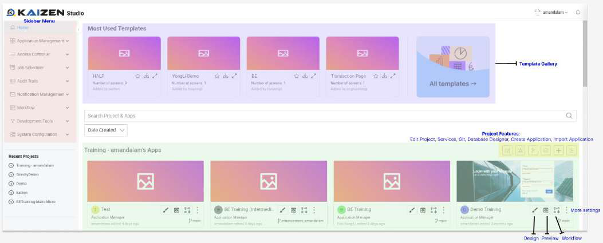

# Core App Designer Features

The KAIZEN App Designer provides several essential features that streamline your development workflow and enhance collaboration. These core features are fundamental to working effectively with the platform.

## Save Draft

The **Save Draft** feature allows you to save your project progress without finalizing the design. This is particularly useful when you want to preserve your work-in-progress while continuing development.

### How It Works

1. **Manual Save:** Click the save button to manually save your current progress
2. **Auto-save:** Automatically saves every 15 minutes (configurable at system level)
3. **Private Storage:** Drafts are stored privately in your account and not visible to other users

### Key Benefits

- **Progress Preservation:** Never lose your work due to unexpected interruptions
- **Private Development:** Work on changes without affecting the published version
- **Flexible Workflow:** Save multiple iterations before finalizing your design
- **Collaboration Safety:** Other users continue to see the published version

### Draft Recovery

When you return to a page with saved drafts:
- **Prompt Dialog:** The system will ask if you want to open the saved draft
- **Choice Options:**
  - **Yes:** Opens the page with your previously saved draft
  - **No:** Opens the page from the latest published revision

### Important Notes

- **Private Access:** Only you can access your saved drafts
- **Account-specific:** Drafts are tied to your user account
- **Page-specific:** Each page maintains its own draft state
- **Temporary Storage:** Drafts are meant for temporary work, not long-term storage

## Publish Page

The **Publish Page** feature makes your finalized page visible to other users in the project. This transforms your private work into a shared resource that the entire team can access.

### Publishing Process

1. **Finalize Changes:** Complete your design modifications and testing
2. **Click Publish:** Use the publish button to make changes public
3. **Confirmation:** The system confirms successful publication
4. **Team Access:** Other users can now view and edit the published content

### What Happens When You Publish

- **Public Visibility:** Your changes become visible to all project members
- **Revision Update:** A new entry is added to the revision history
- **Collaboration Enabled:** Team members can view and continue editing your work
- **Draft Clearance:** Any saved drafts are cleared after successful publication

### Benefits of Publishing

- **Team Collaboration:** Enable other developers to build upon your work
- **Progress Sharing:** Keep the team updated on your development progress
- **Quality Assurance:** Allow team review and feedback on your changes
- **Integration:** Enable other features that depend on published content

### Best Practices

- **Test Thoroughly:** Ensure your page works correctly before publishing
- **Communicate Changes:** Let your team know about significant updates
- **Review Regularly:** Publish incrementally rather than in large batches
- **Document Updates:** Provide context for the changes you're publishing

## Preview Page

The **Preview Page** feature provides a real-time view of how your page will appear and function for end-users. This is essential for testing and quality assurance before publishing.

### Preview Functionality

- **Live Preview:** See exactly how your page will look to end-users
- **Functionality Testing:** Test buttons, links, forms, and interactive elements
- **Responsive Testing:** Verify how your page appears on different screen sizes
- **User Experience Validation:** Ensure the page meets user experience requirements

### Role-Based Access Configuration

When you click the preview button, you'll be prompted to select navigator roles:
- **Role Selection:** Choose which user roles can access the page
- **Privilege Configuration:** Set up necessary access restrictions
- **Testing Different Access Levels:** Preview how the page appears for different user types

### Preview Benefits

- **Issue Detection:** Identify problems before they reach end-users
- **Design Validation:** Ensure your design meets requirements
- **Functionality Testing:** Verify all interactive elements work correctly
- **User Experience Testing:** Test the page from an end-user perspective

### Preview Settings

Access additional configuration options through the application settings icon:
- **Privilege Management:** Configure user access levels
- **Role Assignment:** Define which roles can access specific pages
- **Navigator Configuration:** Set up navigation menu access
- **Security Settings:** Configure authentication and authorization

## Page Lock

The **Page Lock** feature is a mechanism designed to control and manage collaborative editing in shared project environments. It ensures that critical or in-progress work isn't unintentionally modified or overwritten by others.

### How Page Locking Works

1. **Lock Activation:** A user can lock a page to prevent others from making changes
2. **Exclusive Access:** Only the user who locked the page can make significant modifications
3. **Conflict Prevention:** Eliminates the risk of conflicting changes from multiple users
4. **Manager Override:** Project managers can unlock pages when necessary

### Locking Scenarios

- **Critical Development:** Lock pages when working on complex features
- **Quality Assurance:** Prevent changes during testing and review phases
- **Release Preparation:** Lock pages when preparing for production deployment
- **Conflict Resolution:** Use locks to resolve editing conflicts

### Lock Management

- **Lock Status Display:** Clear indication of which pages are locked and by whom
- **Lock Duration:** Locks can be temporary or long-term based on project needs
- **Lock Release:** Users can unlock their own pages when work is complete
- **Manager Control:** Project managers have authority to unlock any page

### Benefits of Page Locking

- **Work Protection:** Safeguard your development progress
- **Collaboration Control:** Manage team editing effectively
- **Quality Assurance:** Ensure changes are made systematically
- **Conflict Prevention:** Avoid editing conflicts and data loss

## Reset Functionality

The **Reset** feature allows you to clear all components from a page, returning it to an empty state. This provides a clean slate for redesigning or starting over.

### Reset Process

1. **Reset Confirmation:** The system asks for confirmation before proceeding
2. **Complete Cleanup:** All components, layouts, and configurations are removed
3. **Empty Canvas:** The page returns to its initial empty state
4. **Fresh Start:** You can begin building the page from scratch

### When to Use Reset

- **Design Iteration:** Start over with a completely new design approach
- **Layout Restructuring:** Clear the page to implement a new layout strategy
- **Component Cleanup:** Remove all components to rebuild systematically
- **Testing Purposes:** Clear the page for testing new component combinations

### Important Considerations

- **Irreversible Action:** Reset cannot be undone once executed
- **Data Loss:** All page content and configurations will be permanently removed
- **Confirmation Required:** The system requires explicit confirmation to prevent accidental resets
- **Backup Recommendation:** Consider saving important work before resetting

### Reset Best Practices

- **Save Important Work:** Export or save any valuable configurations before resetting
- **Plan Your Approach:** Have a clear design plan before resetting
- **Use Incrementally:** Consider making smaller changes instead of complete resets
- **Team Communication:** Inform team members if resetting shared pages

## Revision Management

The **Revision** system provides comprehensive tracking of all changes made to your project over time. This creates a complete version history that supports collaboration and quality assurance.

### Revision Features

- **Change Tracking:** Monitor all modifications and updates to your project
- **Version History:** Maintain a complete timeline of project evolution
- **Rollback Capability:** Revert to earlier versions when needed
- **Collaboration Support:** Track changes from multiple team members

### Revision Benefits

- **Risk Mitigation:** Safely experiment with changes knowing you can revert
- **Collaboration Transparency:** Understand what changes were made and by whom
- **Quality Assurance:** Review changes before finalizing them
- **Recovery Options:** Restore previous working versions if issues arise

### Using Revisions

- **View History:** Access the complete timeline of project changes
- **Compare Versions:** See differences between different revisions
- **Restore Previous States:** Roll back to earlier versions when needed
- **Track Progress:** Monitor how your project has evolved over time

### Revision Best Practices

- **Regular Publishing:** Publish changes regularly to maintain a clear revision history
- **Meaningful Descriptions:** Provide clear descriptions for significant changes
- **Review Process:** Use revisions as part of your quality assurance process
- **Backup Strategy:** Use revisions as part of your backup and recovery strategy

## Integration and Workflow

These core features work together to create a comprehensive development workflow:

1. **Development Phase:** Use Save Draft to preserve your work-in-progress
2. **Testing Phase:** Use Preview to validate your design and functionality
3. **Collaboration Phase:** Use Page Lock to manage team editing
4. **Quality Phase:** Use Revision to track and review changes
5. **Deployment Phase:** Use Publish to make your work available to the team

By mastering these core features, you can work efficiently and collaboratively while maintaining the quality and integrity of your application development process.
