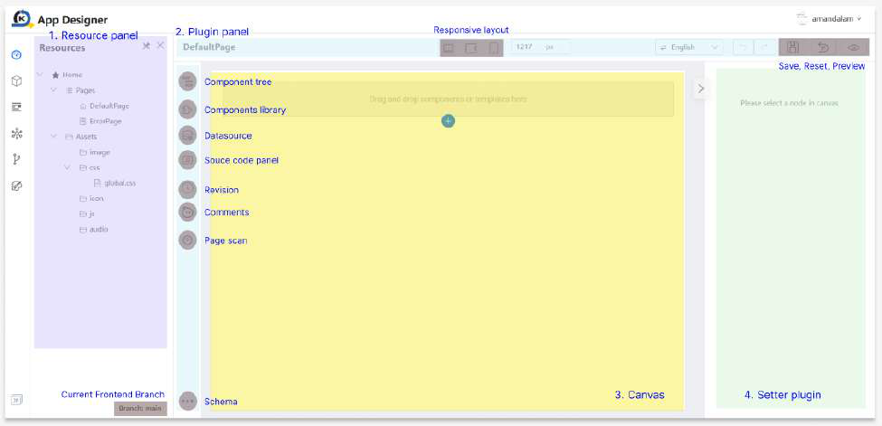

# Overview of the App Designer Interface

The KAIZEN App Designer is a powerful visual environment for building the user interface of your applications. It is divided into three main areas, each designed to streamline your workflow: the **Resource Panel** on the left, the **Canvas** in the center, and the **Plugin and Setter Panels** on the right.

### 1. Resource Panel

The **Resource Panel** is your project's control center. It's where you manage all the pages and assets that make up your application.

-   **Pages:** Create new pages, switch between them for editing, and manage their properties.
-   **Assets:** Upload and organize images, stylesheets (CSS), custom scripts (JS), and fonts.

[Learn more about the Resource Panel](./resource-panel.md)

### 2. Plugin Panel

The **Plugin Panel** contains the tools you need to build and structure your pages.

-   **Component Tree:** A hierarchical view of all the components on your page, showing the layout of Sections, Blocks, and Cells.
-   **Component Library:** A rich library of pre-built UI components that you can drag and drop onto the Canvas.
-   **Datasource:** Manage data connections and API repositories for your application.
-   **Source Code Panel:** View and edit the underlying source code directly.
-   **Revision:** Track changes and maintain version history of your project.
-   **Comments:** Add collaborative annotations and notes to your application.
-   **Page Scan:** Analyze your project for potential issues, errors, or improvements.
-   **Libraries:** Import reusable code and resources into your project.
-   **Schema:** Define JSON data structures and relationships.

[Learn more about the Plugin Panel](./plugin-panel.md)

### 3. Canvas

The **Canvas** is your interactive workspace. It provides a live, real-time preview of your application, allowing you to see your changes as you make them. You can select, move, and resize components directly on the Canvas.

[Learn more about the Canvas](./canvas.md)

### 4. Setter Plugin

The **Setter Plugin** is a dynamic panel that appears on the right when you select a component on the Canvas. It allows you to configure the properties, styles, and events of the selected component.

-   **Props:** Adjust the content and behavior of a component.
-   **Styles:** Customize the visual appearance, from colors and fonts to spacing and alignment.
-   **Events:** Add interactivity by binding component events (like `onClick`) to your code.

[Learn more about the Setter Plugin](./setter-plugin.md)