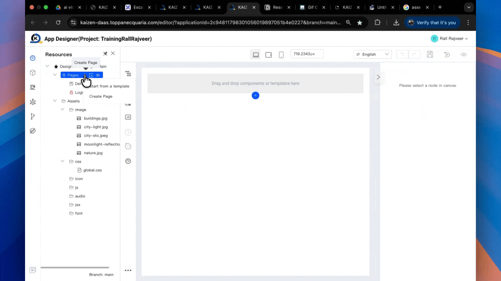
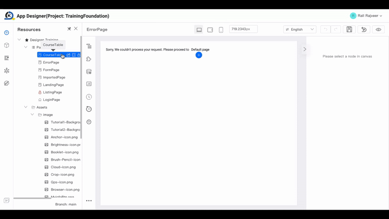
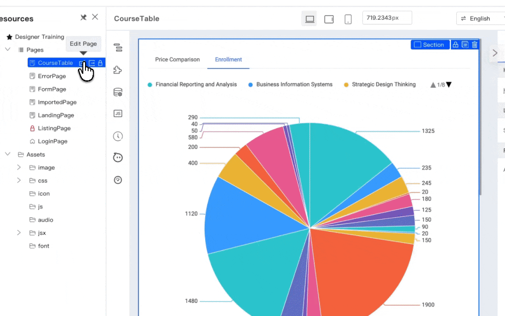
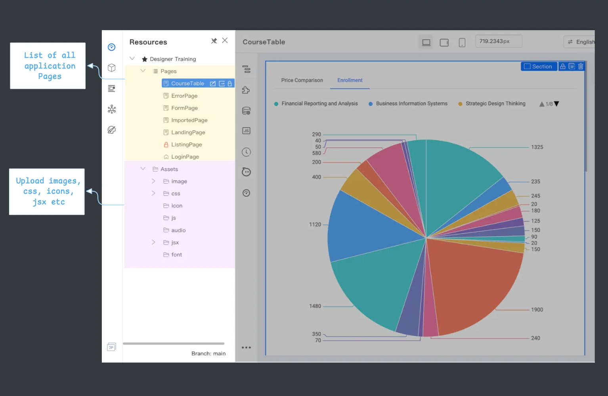

# Resource Panel

The Resource Panel, located on the left side of the App Designer, is your project’s control center. It helps you create, organize, and maintain all the pages and assets your application needs.

## Pages

A **Page** is a separate screen or view in your application, like a login screen, a dashboard, or a product listing. The "Pages" section of the Resource Panel is where you manage the overall structure of your application.

### Creating a New Page

To add a new page to your application, simply click the **"+"** icon next to the "Pages" heading. You will be prompted to enter the page details, such as its name and Page ID.

### Managing Pages

-   **Switching Pages:** Click on any page in the list to load it into the **Canvas** for editing.

    

-   **Editing Page Properties:** Hover over a page and click the edit icon to change its properties, such as its name, Page ID, or layout type.

    

## Assets

The **Assets** section is your project’s media and file library. This is where you upload and manage all the static files your application will use.

### Uploading Assets

To upload a new asset, click the **"+"** icon next to the "Assets" heading. You can upload a wide variety of file types, including:

-   **Images** (JPG, PNG, SVG) for backgrounds, icons, and illustrations.
-   **CSS files** for custom styles that can be applied across your application.
-   **JavaScript files** for custom client-side logic and interactivity.
-   **Font files** to bring your own typography into the project.

By keeping all your resources organized in the Resource Panel, you can easily access them whenever you need them and ensure consistency across your entire application.