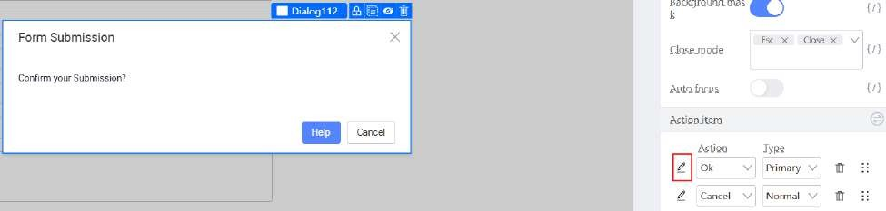

# User Feedback (Dialogs)

Providing clear feedback to users is a crucial part of any application. Dialog boxes are an effective way to confirm user actions, display important messages, or prompt for additional information.

## The Dialog Component

The **Dialog** component in KAIZEN allows you to create modal dialog boxes that overlay the main content of your page.

### Practical Example: Creating a Confirmation Dialog

In this tutorial, we will create a dialog box to confirm a form submission.

#### 1. Add a Dialog Component

-   From the **Component Library**, drag a **Dialog** component onto your canvas. You can place it anywhere, as it will be hidden by default.

#### 2. Configure the Dialog Content

-   In the **Props** tab of the Dialog component, you can set the **Title** and the content of the dialog.
-   You can also customize the text of the buttons, such as changing the "OK" button to "Confirm."

    

#### 3. Control the Dialog's Visibility

-   **Create a State Variable:** In the **Source Code Panel**, create a state variable (e.g., `isConfirmVisible`) to control the visibility of the dialog.
-   **Bind the Visible Property:** In the **Props** tab of the Dialog component, bind the `Visible` property to your `isConfirmVisible` state variable.

#### 4. Trigger the Dialog

-   **Open the Dialog:** In the `onClick` event of your form's "Submit" button, add code to set the `isConfirmVisible` state variable to `true`. This will open the dialog.
-   **Handle the Confirmation:** In the **Events** tab of the Dialog component, bind the `onOk` event to a function that will handle the form submission logic. In this function, you should also set `isConfirmVisible` back to `false` to close the dialog.

By using the Dialog component, you can easily add professional and user-friendly confirmation messages and other prompts to your application.
