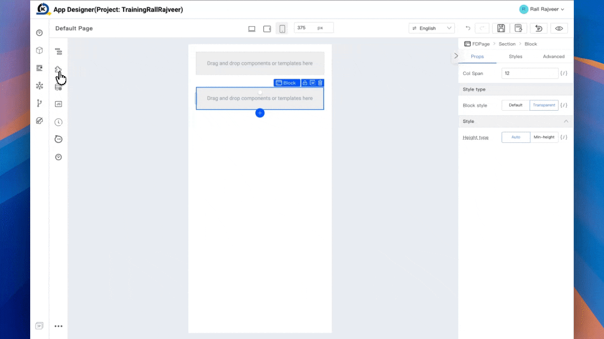
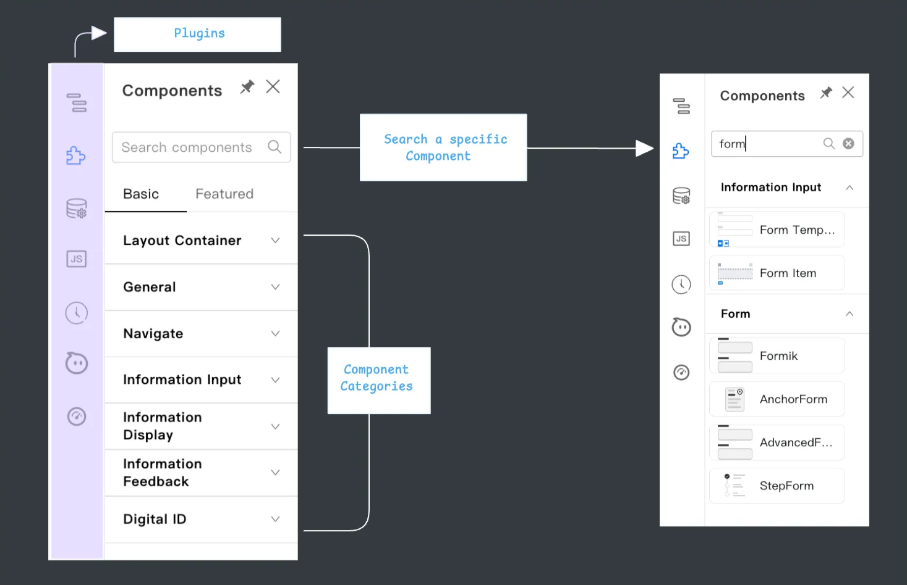

# Components Library

The Component Library is your **toolbox** in Kaizen’s App Designer. It contains all the pre-built, ready-to-use UI components that you can quickly add to your page just like picking the right Lego piece to complete your structure.

While the **Component Tree** shows you the structure of your page, the **Component Library** is where you get the actual building blocks to fill that structure.

## Types of Components

A component is any functional or visual element you can place on your page. Components can range from basic text and images to complex forms, tables, and charts.

You’ll find them grouped logically inside the library, and you can search to locate what you need.

### Common examples include:

- **Basic elements**: Text, images, buttons, dividers.
- **Forms & inputs**: Input fields, text areas, dropdowns, radio buttons, checkboxes.
- **Containers**: Cards, lists, grids, accordions.
- **Media**: Icons, videos, images.
- **Interactive elements**: Tabs, sliders, pagination.

## Adding a Component

1. **Open the Component Library** Click the Component Library icon in the left sidebar (second from the top).
2. **Search or browse** Either scroll through the categories or use the search bar to find a specific component.
3. **Drag & drop** Click on the component and drag it directly onto the Canvas, placing it inside a section, block, or cell.
4. **Customize** Select the component to open the **Setter Plugin** on the right-hand side, where you can edit text, style, theme, and behavior.

## How to use the Component Library effectively

Components in the library are **fully reusable**, allowing you to place them in multiple locations across your project. Once added, you can adjust their style and behavior to match your design needs, or combine them with other components to create more complex layouts.

This flexibility lets you:

- **Build pages quickly** without starting from scratch.
- **Maintain design consistency** by reusing the same elements across different pages.
- **Customize individual components** for unique requirements.

When you drag a component into the Canvas, it automatically becomes part of the **Component Tree** structure, meaning you can navigate to it, move it, or modify it just like any other element in your page layout.

## Example

Let’s say you have a form but it’s missing a **Submit** button:

1. Open the Component Library.
2. Search for “Button”.
3. Drag it into the form’s cell.
4. Use the Setter Plugin to change its label to “Submit” and apply a light or dark theme.

## Conclusion

The Component Library gives you the speed of pre-built elements with the flexibility to customize them. Combined with the Component Tree and Setter Plugin, it allows you to build rich, interactive pages in minutes.

**What’s next:** Resources Panel Overview →