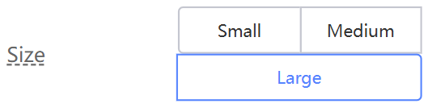

# Navigation (Steps & Tabs)

Navigation components are essential for guiding users through different sections of your application or a sequential process. KAIZEN provides two key components for this: **Steps** and **Tabs**.

## Steps

The **Steps** component is used to break down a complex process, such as a form or a wizard, into a series of manageable steps. This improves the user experience by providing a clear visual indicator of their progress.

### Practical Example: Creating a Multi-Step Form

In this tutorial, we will use the **Steps** component to build a multi-step form.

#### 1. Add the Steps Component

-   From the **Component Library**, drag a **Steps** component to the top of your page.
-   In the **Props** tab, you can configure the number of steps and their titles (e.g., "Course Info," "Instructor Particulars," etc.).

    

#### 2. Create the Form for Each Step

-   For each step, create a separate **Form Template** component.
-   Add the necessary form fields to each form.

#### 3. Implement Step Navigation

-   **Control Visibility:** Use a state variable (e.g., `currentStep`) to control which form is visible at any given time.
-   **Bind to the Steps Component:** In the **Props** tab of the Steps component, bind the `currentStep` variable to the component's active step property.
-   **Add Navigation Buttons:** Add "Next" and "Previous" buttons to each form.
-   **Add Button Logic:** In the **Events** tab of the buttons, bind the `onClick` events to functions that update the `currentStep` variable.

    

By using the Steps component, you can create a clear and intuitive user experience for complex, multi-step processes.

## Tabs

The **Tabs** component is used to organize content into different sections on the same page. This is useful for when you have a large amount of related information that you want to present in a compact and organized way.

To use the Tabs component, simply drag it onto your canvas and then add content to each of the tab panels.
