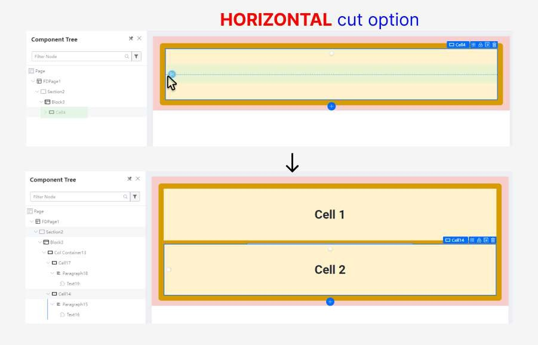

# Practical Example: Building a Screen Skeleton

In this tutorial, we will walk through the methodology of creating a page skeleton from scratch using an example webpage. This will demonstrate how to effectively use Sections, Blocks, and Cells to build a structured and responsive layout.

### The Goal

We will build the basic framework for the following webpage:

---

### Step 1: Create the Initial Layout

First, identify the main horizontal and vertical divisions of the page. This page has a main content area that is split into two vertical columns.

1.  Start with a single **Section**.
2.  Inside the Section, select the default **Block**.
3.  Use the **vertical cut** option to split the Block into two columns, creating a left and a right block for our content.

---

### Step 2: Divide the Left Block

The left block contains two distinct horizontal areas.

1.  Select the **Cell** inside the left Block.
2.  Use the **horizontal split** option to divide the cell into two rows (a top and a bottom cell).

---

### Step 3: Structure the Top-Left Area for Cards

The top-left area will contain a grid of cards.

1.  Select the top cell you created in the previous step.
2.  Use the **horizontal split** again to create two rows.
3.  Use the **vertical split** on each of those new cells to create a 2x2 grid.

---

### Step 4: Add Card Components

Now that the grid structure is in place, you can add the Card components.

1.  From the **Component Library**, drag a **Card** component into the top-left cell of your new grid.

---

### Step 5: Populate the Card Grid

1.  Duplicate the Card component and place a copy in each of the four cells in your 2x2 grid. You can, of course, add more cards as needed.

---

### Step 6: Add the Table Component

The area below the cards in the left column is for a table.

1.  Select the bottom cell from Step 2.
2.  Drag a **Table** component from the Component Library into this cell.

---

### Step 7: Add Components to the Right Block

The right block contains a mix of components. You can now populate this area.

1.  Drag and drop the required components, such as **Text**, **Buttons**, or even other **Cards**, into the cell of the right block.

Your final screen skeleton is now complete and ready for content and styling. This structured approach ensures that your layout is logical, scalable, and responsive from the start.