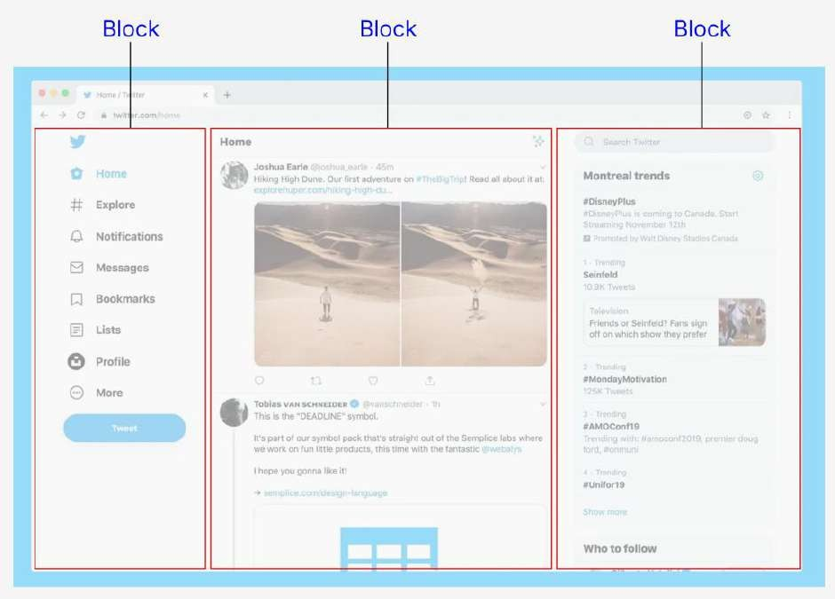

# Layout Hierarchy: Section, Block, and Cell

Building a solid layout is the first step in creating a well-structured and responsive page. In KAIZEN, the layout is built on a clear parent-child hierarchy of three key components: **Sections**, **Blocks**, and **Cells**.

-   **Section:** Can contain Blocks.
-   **Block:** Can contain Cells, but not Sections.
-   **Cell:** Cannot contain Sections or Blocks.

---

## Section vs. Block

Understanding when to use a Section versus a Block is key to creating effective layouts.

### Sections

**Sections** are the largest layout containers. They always take up the full width of the page and are used to group major, related parts of your UI.

-   **Organization:** Use Sections to create distinct horizontal areas, such as a header, a feature showcase, or a footer.
-   **Customization:** Sections offer more customization options for backgrounds and styling.
-   **Scalability:** You can easily add or remove entire sections without affecting the rest of the page.

### Blocks

**Blocks** are used for creating column-based layouts *within* a Section.

-   **Granularity:** Use multiple Blocks to create side-by-side content, such as a two or three-column layout.
-   **Flexibility:** Blocks can be easily rearranged within a Section to adapt to different design requirements.

---

## Block vs. Cell

The distinction between Blocks and Cells is crucial for creating responsive designs.

### Blocks

-   **Layout:** Blocks support a **vertical cut** option and use a structured grid layout.
-   **Responsiveness:** By default, Blocks have a responsive wrapping behavior. When the screen size is reduced, Blocks will stack vertically.

### Cells

-   **Layout:** Cells support both **vertical and horizontal cut** options and use a flexible box layout.
-   **Responsiveness:** Cells do not wrap by default. They are designed to hold content *within* a Block and maintain their relative positions.

By understanding and correctly using the hierarchy of Sections, Blocks, and Cells, you can build complex, responsive, and maintainable page layouts with ease.
