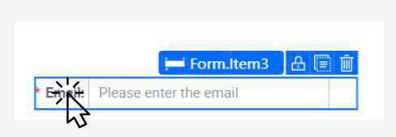

# Responsive Design

Building a responsive layout ensures that your application looks and functions perfectly on any device, from wide-screen desktops to tablets and mobile phones. KAIZEN's App Designer has built-in tools to help you create and preview responsive designs.

## Previewing on Different Devices

The **Canvas** allows you to instantly preview your design on different screen sizes. At the top of the Canvas, you will find icons to switch between desktop, tablet, and mobile views. Use these previews to check how your layout adapts and ensure that content remains readable and accessible on smaller screens.

## Responsive Behavior of Blocks vs. Cells

The layout hierarchy you create with Blocks and Cells has a direct impact on how your application responds to different screen sizes.

*   **Blocks for Major Layout:** By default, when the screen becomes too narrow to fit multiple Blocks side-by-side, they will automatically **wrap** and stack vertically. This is the primary mechanism for creating responsive column layouts. For example, a three-column layout on a desktop will become a single-column layout on a mobile phone.

*   **Cells for Fine-Tuning:** Cells, on the other hand, do not wrap by default. They are designed to hold content within a Block. You can use Cell splitting to create more complex arrangements that you want to maintain across screen sizes.

By combining the automatic wrapping of Blocks with the precise control of Cells, you can create sophisticated layouts that are both powerful and responsive.

---

## Practical Example: Creating a Responsive Login Page

Let's walk through how to create a responsive two-panel layout for a login page.

### 1. Create a Two-Column Layout

To create a responsive layout that adapts to smaller screens, we will use the **Block** component to design the left and right panels of the page.

- With the Block component selected, hover over the middle handle until the **Cut icon** appears, then click it to vertically split your block into two.

    

### 2. Add Content Containers

- From the **Components Library**, drag a **Box** component into each of the two cells you just created. These will serve as the containers for the left and right panels.

    

### 3. Style the Panels

- Select the first **Box** (left panel) and apply your desired styles. For example, you can set a background color and ensure the height is set to `100%` to fill the available space.
- Do the same for the second **Box** (right panel).

    

### 4. Observe the Responsive Behavior

When you switch to the mobile preview, you will see that the two blocks automatically stack on top of each other, creating a user-friendly, single-column layout.

This demonstrates how KAIZEN's layout system, with its intelligent use of Blocks, makes it easy to build responsive designs with minimal effort.