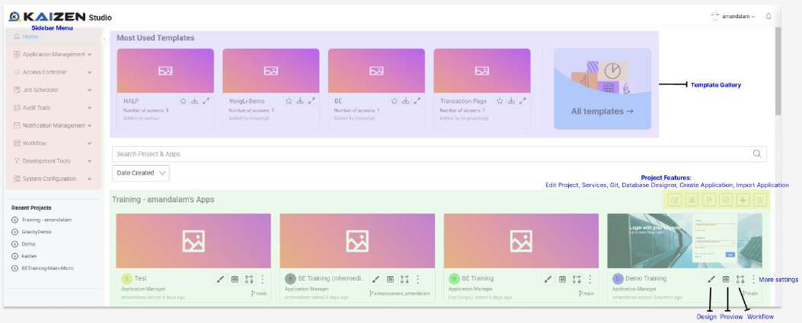
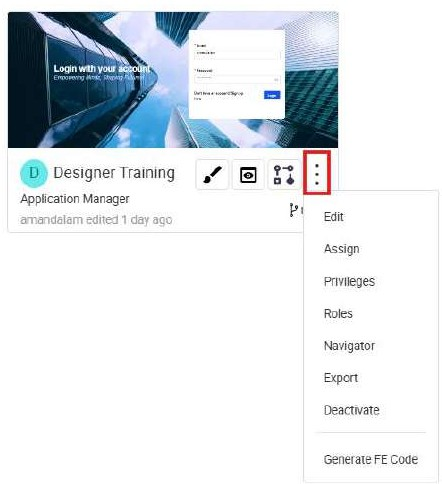
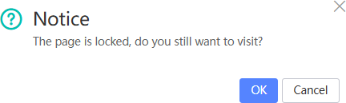
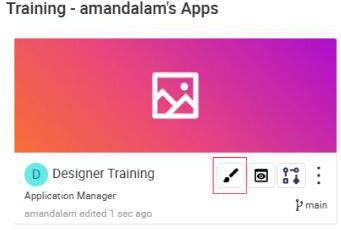

# A Tour of the KAIZEN Studio

The KAIZEN Studio is your central hub for building and managing applications. It provides access to all the powerful designers and tools you need to bring your vision to life.

Note that not all features may be accessible depending on your assigned role. The platform uses Identity and Access Management (IAM) to control access, ensuring that users only see the tools relevant to their responsibilities.

## App Designer

The App Designer is where you will spend most of your time creating the user interface of your application. It is composed of several key panels:

*   **Resource Panel:** Manage and access the various pages of your application.
*   **Plugin Panel:** Access the Component Tree, Components Library, and other tools to build your UI.
*   **Canvas:** The visual workspace where you design and arrange the elements of your project.
*   **Source Code Panel:** View and edit the underlying source code of your project.

### Saving and Publishing

In KAIZEN, you can save your progress as a draft or publish it for others to see.

*   **Save Draft:** When you save a draft, it is stored privately in your account. Other users cannot see your changes until you publish them.

    

*   **Publish Page:** When you publish a page, your changes become visible to other users with access to the project.

    

### Previewing Your Application

The preview feature allows you to see how your page will look and function before it goes live. You can also test the user experience for different roles.

### Collaborative Editing with Page Lock

The Page Lock feature prevents multiple users from editing the same page simultaneously, avoiding conflicts and ensuring a smooth collaborative workflow.

## Starting a New Project

When you start a new project, an empty application will be created for you. You can start editing it by clicking on the design icon.

