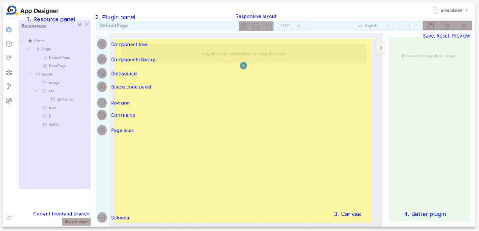

# Studio Console

Note that not all the Sidebar Menu Items and Project Features will be accessible in your trainee account due to Identity and Access Management (IAM) access restrictions. In order to access the features, the respective roles need to be granted to your user account.

In a project scenario, our application offers predefined roles that can be assigned to users, such as Project Manager, Developer, UI Designer, Internal Viewer, and External Viewer. Each role is tailored with specific access levels, enabling precise control over features and 
functionalities for managing both applications and the overall project.

For more information on the IAM features, you may refer to Tutorial 28.

App Designer

1. Resource panel: The Resource Panel is where you manage and access various pages 	related to your application.

2. Plugin panel: The Plugin Panel is a section that displays and allows you to manage the plugins or extensions integrated into the platform or software. Plugins enhance functionality or provide additional features.

● Component Tree: The Component Tree is a hierarchical view that represents the structure of the components within your project. It visually organizes and displays the relationships between different elements.

● Components Library: The Components Library is a collection of pre-built 	components that you can easily drag and drop into your application.

● Datasource: Datasource refers to the data connection or repository from which 	your application retrieves information such as API.

● Source code panel: The Source Code Panel is where you can view and edit the underlying source code of your project. It provides direct access to the code for users who prefer or need to work at the code level.

● Revision: The Revision feature allows you to track changes made to your project over time. It provides a version history, making it easy to revert to a previous state if needed.

● Comments: Comments are annotations or notes that you can add to your application. They provide explanations, insights, or instructions for yourself or collaborators.

● Page scan: Page Scan is a tool that analyzes and checks your project or application for potential issues, errors, or improvements. It helps ensure the quality and performance of your work.

● Libraries: Libraries are collections of reusable code or resources that can be imported into your project. They save time and effort by providing pre-built functionalities.

● Schema: Schema defines the structure and organization of your data in JSON format. It outlines the relationships, constraints, and rules governing how data is stored and accessed.

● Responsive layout: Responsive Layout refers to the design approach that ensures your project adapts and looks good on various devices and screen sizes, providing a consistent user experience.

● Save Draft, Publish, Reset, Preview: Save allows you to save your project progress, Reset reverts changes, and Preview enables you to see how your project will appear or function before finalizing.

● Page Lock: Mechanism designed to control and manage collaborative editing in a shared project environment. This ensures that critical or in-progress work on a page is not unintentionally modified or overwritten by others, providing a conflict-free editing process.

3. Canvas: The Canvas is the visual workspace where you design and arrange the 	elements of your project. It's the area where you create and build.

● Component operation: Component Operation involves managing and manipulating individual elements or components within your project, such as copying, locking, or deleting them.

4. Setter plugin: A Setter Plugin is a tool or extension that allows you to configure or set 	specific properties or attributes of components within your project.

We will now explore the fundamental concepts behind some key features of the App Designer listed above. These will be used heavily during the creation of your application screens. To

demonstrate these features in action, we have prepared a shared project that all trainees can access - TrainingFoundation.

This setup allows you to observe how these features behave in a collaborative environment, particularly when actions are performed by other project members. You will also gain insight into how these actions affect visibility and interaction from your perspective.

Save Draft

The Save Draft feature allows you to save your project progress in KAIZEN app designer if you wish to save the progress without finalizing the design. In the below steps, we will guide you through the save draft function in KAIZEN designer.

● First, we will amend the text below and save the draft.

● After which, you may click on the revision button and you can see that a draft has been 	saved in revision.

● We also have an auto-save mechanism every 15 minutes in the app designer. This time 	period can be configured at system level depending on project needs.

● Now, when you close the KAIZEN App Designer and re-open the same application again, or navigate to another page and back to this same page, it will prompt open draft revision dialog if there is a draft saved on this page.

○ Click “Yes” if you wish to open the draft saved previously. It will open the page 	that we saved previously in draft.

○ Click “No” if you wish to open the page from the latest revision.

● Do take note that when you save a draft, it is stored privately in your account’s application. This means that only you have access to it, and other users cannot view or edit your saved work.

● Revision history from another account differs, where the draft will not be visible to 	another user.

● However, if you wish to save your changes and visible to other users, you have to 	publish the page.

Publish Page

The Publish Page feature allows you to save your finalized page in KAIZEN app designer. Once published, your page becomes visible to other users. This means that team members, 
collaborators, or any designated user can view and interact with your content. It transforms your private draft into a shared resource. In the below steps, we will guide you through the publish function in KAIZEN designer.

● First, let's try to amend the text below and publish the page.

● Click on the revision button, and you can see a new revision history is updated.

● Now, close the KAIZEN App Designer and re-open the same application again. It will not prompt open draft revision dialog anymore as currently there is no draft saved in the application.

● When you publish the page, it will be visible to other users in the project. This means that other users can view or continue editing your work which has been published. The revision history from another account will be the same.

Preview Page

The Preview Page feature allows you to see how your page will look and function.The preview feature provides a real-time view of your page, showing exactly how it will appear to end-users.

Besides, you also can test the functionality of your page, including buttons, links, forms, and other interactive elements. This helps you identify and fix any issues before making the page live.

Note that once you click on the preview button, you will be prompted to select the navigator roles in which you want to preview. This functionality aids in the configuration of necessary privileges and roles during the design stage to restrict the access of pages through the navigator menus in the application. However, in this training tutorial, we will not need to indicate or choose the user domain or role name. Simply click on ‘Confirm’ to skip this selection and your application preview without any access restrictions.

For example, you may configure at application level by clicking on this icon for more settings. This is where you can configure the relevant privileges > roles > navigator for your application pages. We will cover more on navigator in Practical 9.2and more on privileges and roles in Tutorial 28on IAM.

Page Lock

The Page Lock feature is a mechanism designed to control and manage collaborative editing in a shared project environment.This feature ensures that critical or in-progress work on a page is not unintentionally modified or overwritten by others, maintaining the integrity of the content.

When a page is locked, it becomes restricted for other users. This means no other users can make significant changes and publish the page until it has been unlocked by either the user who locked the page initially or the project manager.

● In the shared TrainingFoundation project, we have locked the Login page to illustrate 	how this feature functions.

● You can view the locked page and experience first hand what happens when they try to 	perform certain actions.

● Notice that if you make changes then preview or publish the page, it will be restricted.

Reset 
The Reset feature will reset your page to an empty page, allowing the user to remove all the components added in the page with a reset button.

Note that you will not be able to undo this change!

Tutorial 1: Creating a responsive Login page

This tutorial covers the following Learning Objectives:

● Understand how to design a basic responsive login page using KAIZEN ● Experience the benefits of KAIZEN for rapid development.

A login page is the entry point for user authentication, ensuring secure access to your application. In this tutorial, we will create a login page using KAIZEN

In KAIZEN Studio, you will see a Training Project which has been created with your trainee username. An empty application, ‘Designer Training’ has also been created for you to design and create your application following the tutorials below.

You can start editing the Designer Training App by clicking on the highlighted icon as shown in the image below.

Since we are creating a Login page, change the Name and Page ID of the ‘DefaultPage’ to ‘LoginPage’ and click Save.

You will see a success message pop up:

