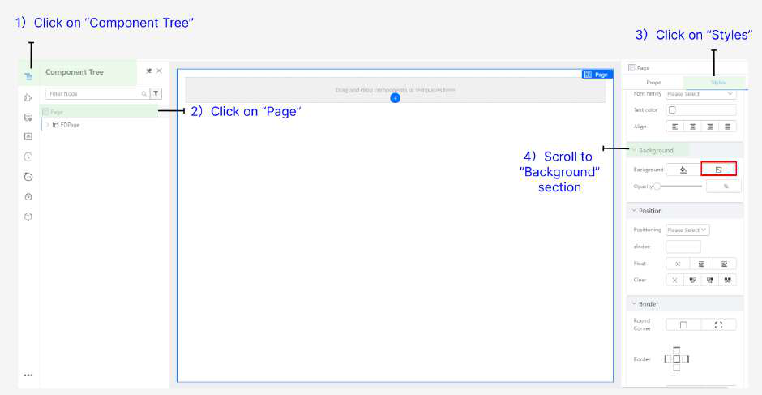
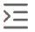

# Practical 1.1: Add Background Image

● Download image url: 
● Upload the image asset in the resources panel by clicking on + icon

● Click Save

● Select Page from the Component Tree and navigate to Styles tab ○ Step 1: Click on Component Tree
○ Step 2: Click on Page 
○ Step 3: Click on Styles 
○ Step 4: Scroll down to Background section

● Click on the image upload icon

● Select on the background uploaded earlier and click Confirm

● Set the background-size (Size) as Cover

● Set the Repeat Display as No-repeat

● The resulting styles will be as follows:

Expected result will look like:

Practical 1.2: Create Responsive Layout

● Click on the empty Cell and navigate to the breadcrumb at the top right corner of your 	page. Click to select the parent component Block to be selected instead.

● In order to design this login page to be responsive and adapt to smaller screen sizes, we will be utilising the Block component to design the left and right panel of the page. For more information, you may refer to Tutorial 13.

● With the Block component selected, hover on the middle white dot for the Cut icon to 	appear, click on it to vertically cut your block into two.

● Click on Components Libraries
● Drag a Box component to each cell shown in screenshot below

● Select the Cell (Outer layer of Box) by clicking on the containing area

● Set the following properties

● Set the same for the cell on the right so achieve the following

● Select the first Box (Left), and set

● In the same Box, and set the Styles

The height of the box is set to 100% so that it is relative. Since it is empty with no child components inside it yet, it is expected for the box to currently look empty as follows.

● Select the second Box (Red-highlighted)

● Set the Styles to the following:

The following sections (Layout, Background, Border) are to be edited:

Similar to the box on the left, due to the relative height configured in percentage, the expected result will be:

You will still be able to select your respective Box components under the left and right Block components via the Component Tree.

