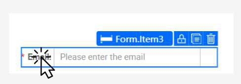

# Practical 1.3: Add 4 Text components

● Ensure that the left Box component is selected ● In the Component Library
	○ Search for keyword “text”, 
	○ Drag one Text Component into Box (left)

● Set the following properties and styles

● Expected result will be:

● Add three additional text components and set the following properties and styles:

● Your completed left box should look like this:

Practical 1.4: Add Form Template	● In the Component Library:
		○ Search for “Form Template” 		○ Drag the component into right Box

○ Set the Styles of Form Template

● Select the first Form Item by clicking on the label “Email”

● Set the properties to

● Select the Form Item (label “Password” ) and set

● Delete the Reset button by clicking on trash icon

● Select the last form.item by clicking on the containing area (Beside Submit button)

● Set the last form item with the following:

● Set the last form item (Submit button) with the following:

The expected result will be:

This page is also designed to be mobile responsive and adapts to smaller screen sizes. You may toggle between the screen sizes using the responsive layout at the top of the page here.

Since we have used blocks to design the two left and right segments of this login page, when toggled to mobile view, the blocks automatically stack in a user-friendly interface as follows.

For more information on mobile responsive features, refer to Practical 10.2.

For more information on the process of structuring the screen layout to ensure flexibility and for it to adapt to varying screen sizes, refer to Tutorial 13.

