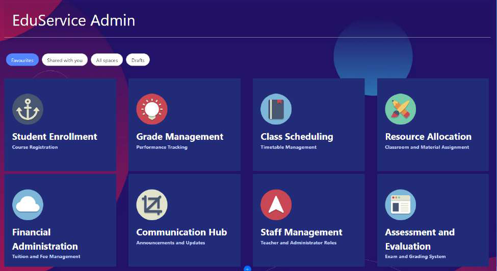
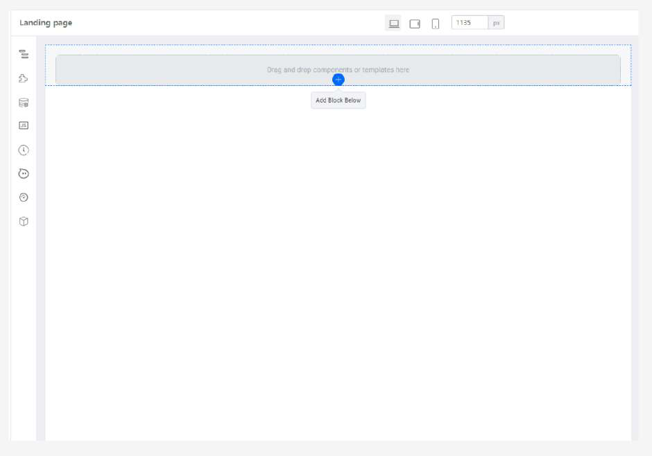
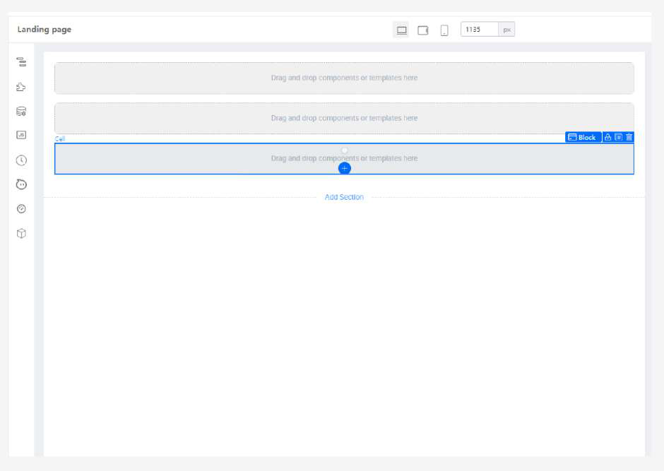

# Tutorial 2: Creating the Landing Page

This tutorial covers the following Learning Objectives:

● Understand how to design and build an effective landing page using KAIZEN.

● Learn how to structure the landing page to provide intuitive navigation and a welcoming 	user experience.

● Explore how KAIZEN simplifies the process of customizing the landing page, including 	adding images, text, and buttons.

In this tutorial, we will walk you through the steps to design and build an effective landing page using KAIZEN. You'll learn how to structure the page to ensure intuitive navigation and create a welcoming user experience. Additionally, we’ll explore how KAIZEN makes customizing the landing page easy, allowing you to add images, text, and buttons seamlessly.

In order to create a new page, click on ‘Create Page’ of your application’s Pages and indicate your page details accordingly before clicking Save.

Practical 2.1: Create Initial Layout
	● Click Add Block Below (2 times) to add 2 more block

The expected result will be:

Practical 2.2: Create heading
	● In the first top Cell, add a Text component

● Set the properties and styles to

The expected result will be:

● Add a Divider (in the first top Cell, below the ‘EduService Admin’ text)

● Delete the text “Delimiter” from the Divider’s label

