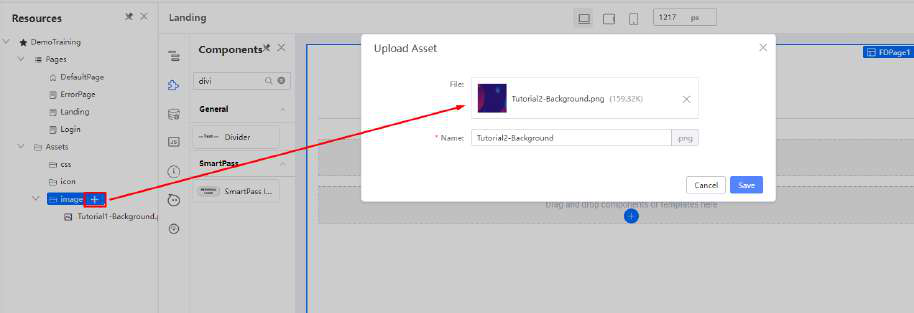
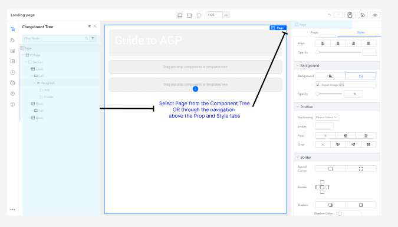
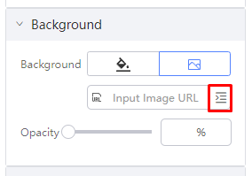
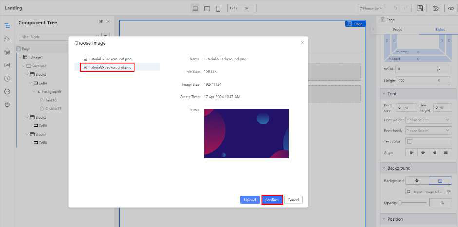
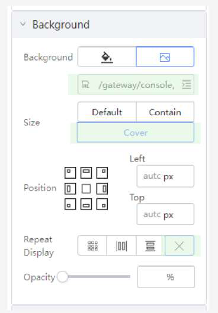

# Practical 2.3: Add Image Background to root page

● Download image url: ● Upload the image asset in the resources panel

● Select Page (you can do via either of the following): ○ Select Page from the Component Tree OR ○ Via the navigation above the Prop and Style tabs

● Click on the image upload icon

● Select on the background uploaded earlier and click Confirm

● Set the following styles

The resulting styles will be as follows:

The expected result will be:

