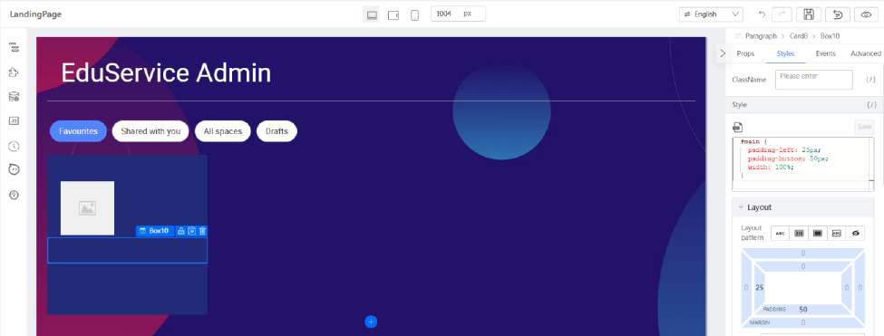
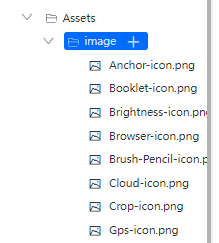
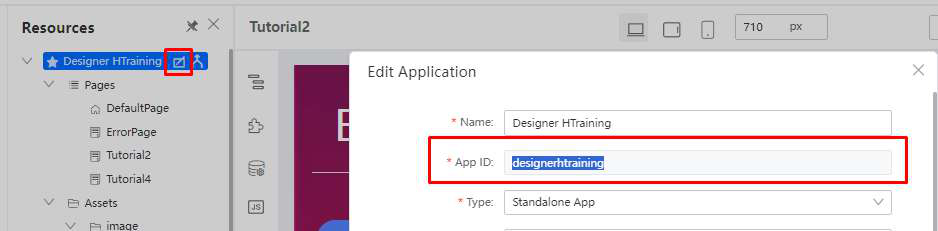
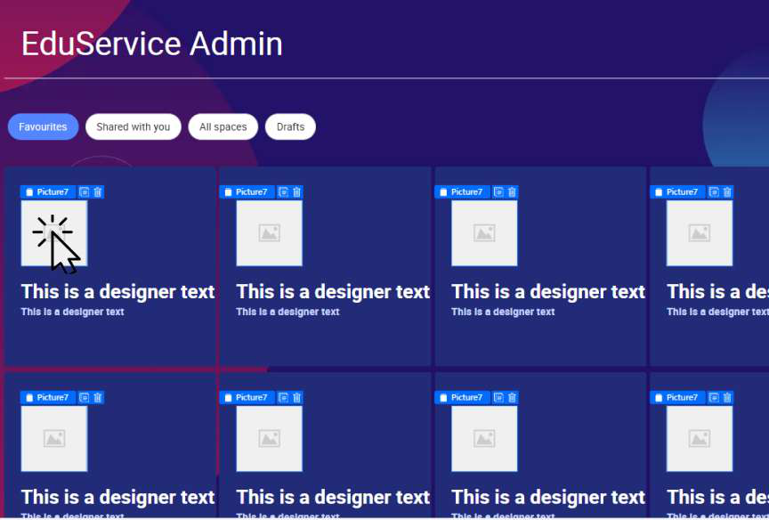

# Practical 2.5: Create responsive card

In this practical, we will guide you through creating a simple, responsive card component. A responsive card adapts to different screen sizes, providing a clean and readable layout for your content on mobile, tablet, and desktop devices.

● In Component Library: 
	○ Search for “Card”

○ Drag into Cell (Last cell shown in screenshot below)

● Set the Card with the following

● In Component Library: 
	○ Search the “Picture” component

○ Drag it into the Card component  (Blue background as shown in screenshot 	below)

● Set the Picture component with the following:

● In Components Library: 
	○ Search for Box component

○ Drag a Box below the Picture component

● Set the Box with the following:

● Drag Text component (2 times) into the Box (illustrated below)

● Set the first Text with the following:

● Set the second Text with the following:

● Download these 8 images from this folder: ● Upload these images into asset in the resources panel

● Download  edit all the image path to your app id as located here.

● Edit the image path 
E.g 
/gateway/console/api/v1/asset/{yourapp-id}/assets/image/Anchor-icon.png?branchName=main

● Select the Card component and navigate to Advanced (Top Right Corner) tab

● Click on Bind data

● In the pop-up, update the data with the following value (card-json-data.txt below):

The expected result will be:

● Select Picture component by clicking on it

● In the dropdown, select Variable Input to bind data:

● In the popup box, update the value “this.item.imageUrl” under Bind variables

● Click Confirm to update the value

The expected result will be:

● Select the Heading Textbox and click on Variable Binding

● Set the following property

● Select the sub-heading Textbox and set the following:

The expected result will be:

● Click on the Container Area and ensure Cell is selected

● Set the following properties

The expected result will be:

