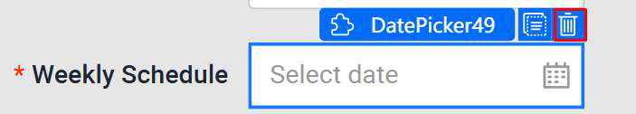
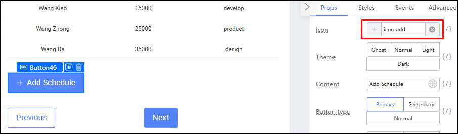

# 4.5.3 Requirements

For the Weekly Schedule:

● Each schedule contains the Day of the week, Start Time and End Time.

● The user must be able to create new rows representing a new schedule.

4.5.4 Custom Date Validation 
	● Open the Source Code Panel and uncomment lines 7 - 8.

● Uncomment the section under (lines 39 - 57). Then click the Save button.

● Select the Start Date Form Item. Variable Bind the validation state to 	this.state.startError

● Select the End Date Form Item. Variable Bind the validation state to 	this.state.endError

● Ctrl + Click toselect both the Form Items of Start Date and End Date.

● Go to the Props tab, and click on Custom validation. Then, click on the Bind Function 	button.

● Under Select event, click on Event, then click on checkDates. You should get 	something like this before clicking on the Confirm button:

● Go to Preview and check if the validation is working as intended by selecting the dates 	for both datepickers and deliberately choosing invalid values.

4.5.5 Creating the Form field that can add new Rows 	● Delete the DatePicker component under Weekly Schedule field

● Remove the Mandatory Validation

● Drag a Table Component to the Weekly Schedule Form Item.

● Select the Table Component. Under the Props tab, 	○ Turn off pagination.

○ Remove the ‘Add’ and ‘Edit’ entries in the Action Bar.

○ Remove the ‘Edit’ and ‘Preserve’ entries in the Action Column.

● Add another Cell below the Weekly Schedule Table Form Item.

● Then, drag a Button Component into it.

● In the Props Tab for the button’s Form Item, change the following ○ Clear its Label
○ Size: Large
○ Wrapper Column offset to 4 so that it aligns with the table. ○ Change the button’s text to Add Schedule.

● Add a + icon to the button

● Select the Table Component again. Change the Data Columns to ‘Day’, ‘Start Time’ 	and ‘End Time’.

● Edit each column by clicking on the pen icon on the left of each label. Change the Data Keys of Day, Start Time and End Time to ‘day’, ‘start’ and ‘end’ respectively. Set all their Data Types to ‘None’.

○ Repeat the above steps for Start Time and End Time

● Drag a Select Component into the Date Column. Drag a Timepicker Component into 	the Start Time and End Time Columns.

● Select one of the Select Components in the Day Column and add the following 	Options
		○ Monday’, ‘Tuesday’, ‘Wednesday’, ‘Thursday’, ‘Friday’, ‘Saturday’ and ‘Sunday’.

● Select the Timepickers in the Start Time and End Time columns. Under the Props tab, ○ Set the Format to HH:mm
○ In the Styles tab, set the width of the Timepickers to 150px.

● Open the Source Code Panel and uncomment lines 9 - 13.

● Uncomment the section under /** 4.5.5 **/  (lines 61 - 69). Then click the Save button.

● Select the Weekly Schedule Table Component. Click on Variable Binding in Data 	Source.

● Click on State Attribute under Variable List, then click on weekly. Then click the 	Confirm button.

● Click on the Add Schedule button. Go to the Events tab, and click on the ‘Component 	native event’ button.

● Select the onClick event from the dropdown.

● Under ‘Select event’, click on Event, then click on onClick_AddSchedule. Then Click 	the Confirm button.

You can now add extra schedules!

4.5.6 Form Completion 
Your finished Form 4 should look like this:

Practical 4.6: Cascade Dropdown 
4.6.1 Context 
Recall the 1st form, Course Info. There were 2 Select dropdown fields in that form: 	● Enrollment Type - which is values like Part-time, Full-time and Online/Remote.

● Subject Type - The subject of the course (eg. Business, Computing etc.) 
Now, let’s say there was a change in requirements: the Part-time, Full-time and Online/Remote courses can only have certain subject types. What we will need to do is to implement some conditional logic to handle that.

4.6.2 Requirements 
In the 1st Form, Course Info, 
	● The Select dropdown from Enrollment Type should populate a different set of values of 		Subject Type:

4.6.3 Adding the Logic 
	● Open the Source Code Panel and uncomment lines 14 - 25.

● Uncomment the section under /** 4.6.3 **/  (lines 76 - 81). Then click the Save button.

● Click on the Select Component of the Enrollment Type Form Item. In the Events tab, click on the Component native event button and then click onChange from the dropdown.

● Under Select event, click on Event, then click on onChange_EnrollmentType. Once 	done, click on the Confirm button.

● Click on the Select Component of the Subject Type Form Item. Click on the Switch 	Setter on the top right of the Datasource panel.

● Select the Variable Input from the dropdown.

● Click on the “Please input expression” box and select this.state.subjectTypeArray

You can now click preview and check out the result: Part-time:

Full-time:

Online/Remote:

