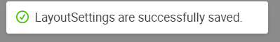

# Practical 9.2: Navigator Creation / Page Linking

This practical covers the following Learning Objectives:

● Learn how to create and organize navigators within your application.

● Explore how to enhance user experience by designing intuitive and easy-to-use 	navigation menus.

● Learn how to create a custom navigator and menu within your application. ● Customize the user experience by creating tailored navigation flows.

● Understand how to link pages efficiently to ensure smooth navigation for users.

In this practical, you will learn how to create navigators for your application, enabling users to easily navigate between pages. We’ll guide you through the process of linking pages effectively, ensuring that the navigation is intuitive and user-friendly. By the end of this tutorial, you will be able to design and implement an organized, seamless navigation system that improves the overall user experience within your application.

9.2.1 Navigator Creation 
	● Navigate back to your own project and application.

● Click on Navigator to edit the setting

● Now, when you preview your application, you will be able to see your newly created 	navigator, which brings you to the Landing Page upon click.

9.2.2 Customize Navigator Menu 
After creating your Navigator Menu, you will learn how to customize the navigators and menus for your application, providing a personalized user experience.

● Preview your application.

● Click on the Setting icon in order to start customizing your navigator menu. We will now 	proceed to edit the menu color.

● In the settings, note that there are many CSS properties to change navigator menus

● Change the Navigation Mode to ‘Top Menu Layout’

● Edit “Menu Item Hover Font Color” to change menu color on hover

● Click on “Save To Application”. This will save your changes across all pages to your entire application. If you only want to customize at page level, you can click on “Save To Page” instead.

9.2.3 Page Linking 
Once all your pages and Navigator Menus are created, we can connect them to ensure a seamless experience by binding the onClick event.

● In your Login Page, bind the onClick event.

● Add the following code in the JS Source Code Panel.

The navigateTo function takes in two parameters, the “App ID” and “Page ID”. Replace with your application IDs accordingly.

● Save your changes and try to login in preview mode! Your page should navigate over to 	the landing page successfully.

