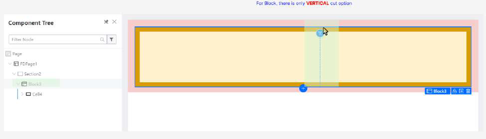
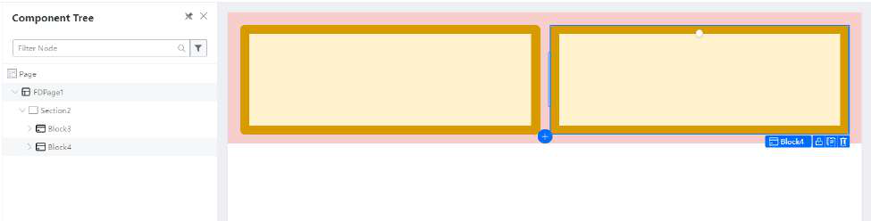
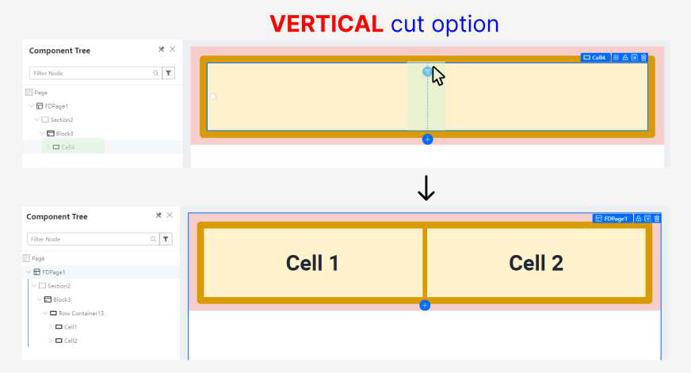
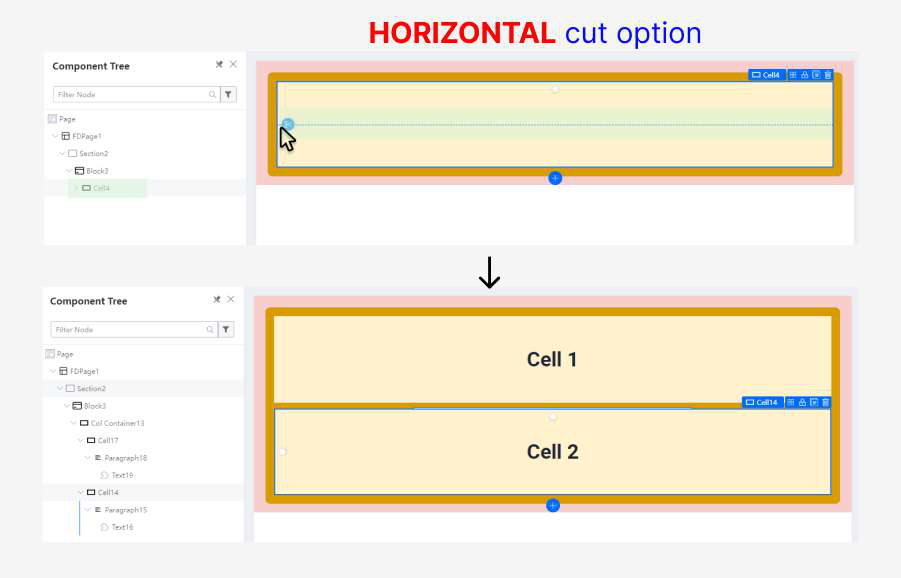
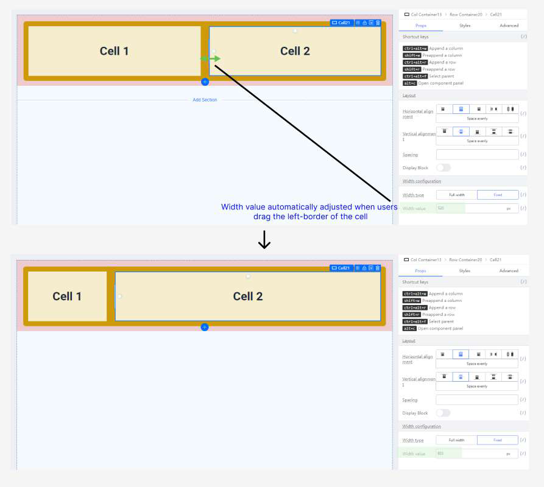

# Layout: Block vs Cell

Block:

● Supports Vertical Cut option

● Uses structured grid layout  through configuring “Col Span” property

● Granularity: Using multiple blocks allows for a more granular approach to content management. Each block can represent a smaller unit of content or functionality, giving you finer control over the layout and presentation.

● Flexibility: Blocks offer flexibility in arranging content within a section. You can easily rearrange blocks or add new ones without restructuring the entire layout, providing greater adaptability to changing requirements or user preferences.

Cells:

● Supports Vertical and Horizontal Cut option

● Uses flex layoutthrough adjusting the span (width)

● Modular Layouts: Cells allow for modular design by segmenting content into smaller 	units within a Block.

● Flexible Styling: Provides flexibility in styling individual cells, including formatting, 	borders, padding, and other visual properties.

● Tabular Data Presentation: Ideal for presenting tabular data with rows and columns, 	enhancing readability and organization.

Block VS Cell 
In Desktop view, the layout structure for Block and Cell looks like this:

In Mobile view, the layout structure looks like this:

By default, using Block will have a responsive layout wrap behavior, while Cell does not.

