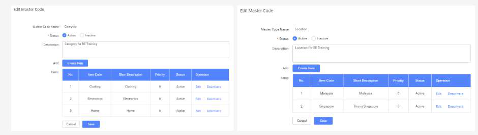
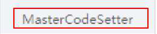
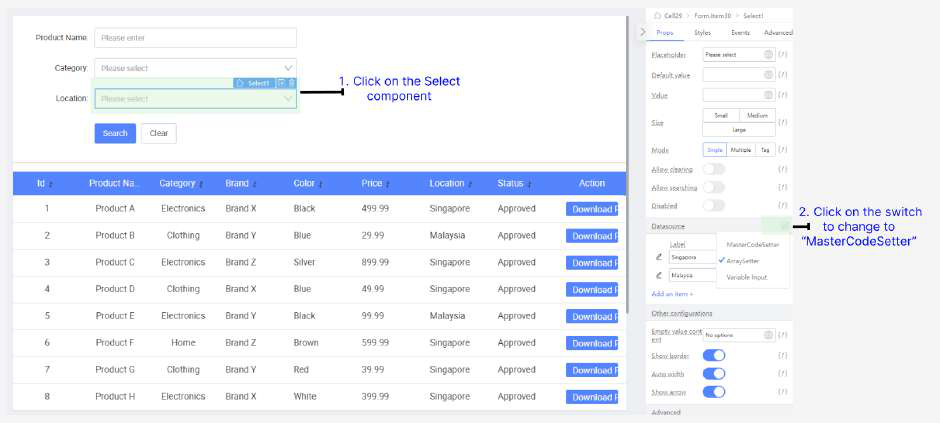
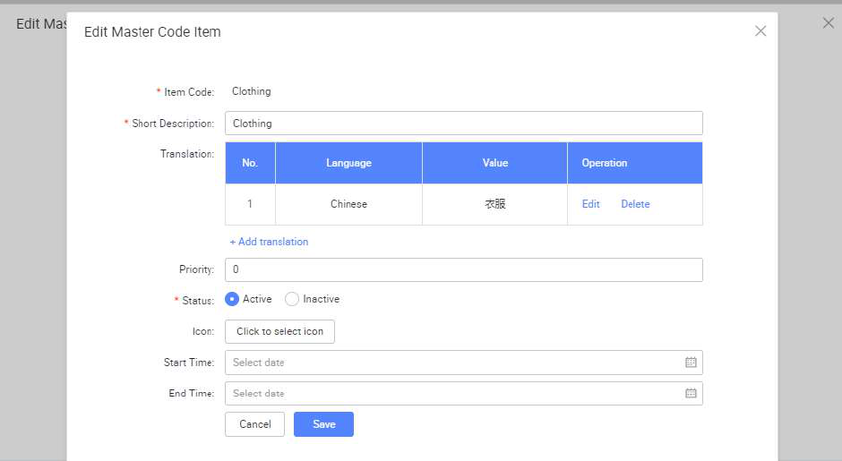
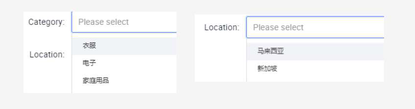

# Practical 15.1: Integrating Master Code

● (Note) Two Master Codes “Category” and “Location” were already created

● In App Designer, click on Page1 Table page

● Click on Category search field

● (Note) Notice that the current values for this dropdown are static and hardcoded under 	Datasource section

populate this field

● Select MasterCodeSetter

Note: MasterCodeSetter supports multiple components such as Select, Cascader, CascaderSelect, PhoneInput.

● In the dropdown, select Category

● Similarly,select Location form search field. Under Datasource, click on switch icon 	and change to MasterCodeSetter

● In the dropdown, select Location

● Preview the page

● Perform the Searching function. Note that it still works as intended using Master Code 	values fetched dynamically, instead of hardcoded values

Practical 15.2: Multi language support(Optional)

Master code feature has a multi-language support. This enhancement will allow users to view

and select master codes, such as location codes, in their preferred language, improving the

accessibility and usability of your application for a global audience.

● Master code translation to Chinese have already been created

● Click on “Edit Application”. Note that multi-language support “Chinese” is enabled.

● Preview the page and select “Chinese” as the language

● In the dropdown select, noted that master code is using chinese translation

