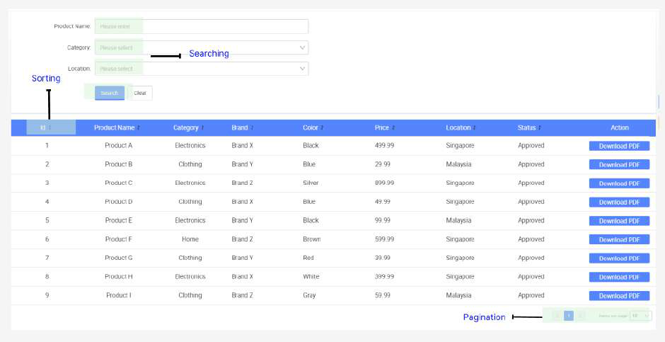
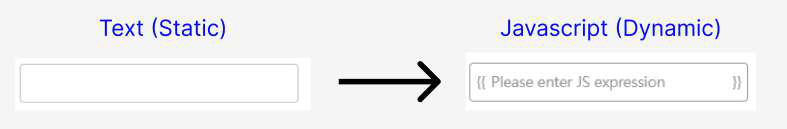
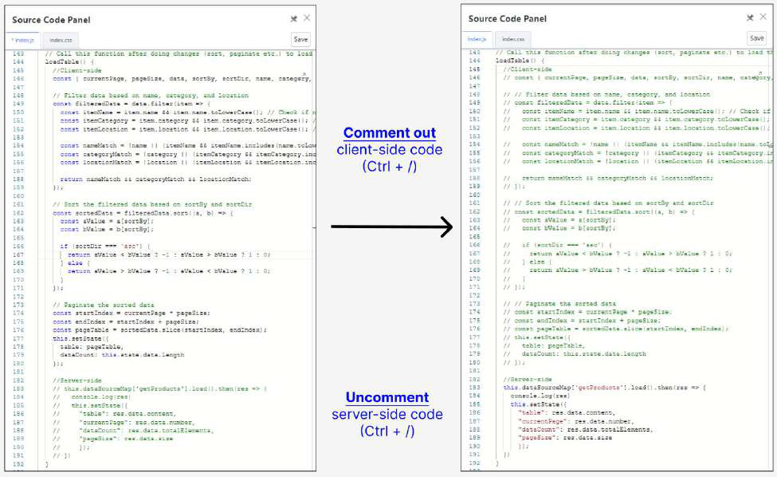

# Tutorial 19: Datasource API Binding

This tutorial covers the following Learning Objectives:

● Understand how to bind datasources to APIs using HTTP GET and POST methods 	within a low-code platform.

● Learn to handle and process various data types, datasources during API binding.

●

In this tutorial, you'll discover the Datasource API Binding feature of KAIZEN, which allows you to seamlessly connect and interact with external datasources. This feature enables you to bind APIs through GET and POST methods, retrieve and send data in diverse formats, and configure datasources to suit your application needs. By mastering these capabilities, you'll create dynamic and responsive applications that effectively manage data from multiple sources, enhancing their functionality and scalability.

Practical 19.1: Binding API to Table(GET)

Binding an API to a frontend design enables seamless interaction between the user interface and backend services. This process allows developers to easily connect UI components to RESTful APIs, facilitating real-time data retrieval and manipulation with minimal coding. KAIZEN uses intuitive drag-and-drop interfaces, making it accessible for users with varying technical skills. This approach accelerates development, enhances maintainability, and allows teams to focus on business logic and user experience, leading to quicker deployment and improved application quality.

● Navigate to the App Designer page by clicking on the Design icon

● Go to Page1Table page by clicking on the Resource panel

● Explore the client-side feature (Searching, Sorting, Pagination)

● Select Datasource and click Create

● In the pop-up window, select getProducts and click Next

● In the datasource configuration panel, click the V icon and select Expression

It will change the text box to javascript expression, allowing values to be evaluated dynamically

● Ensure all other fields are changed to Expression

● Enter the following details for the datasource configuration and click Create:

● Locate the loadTable() function in Source Code Panel

● Comment out Client-side code and Uncomment Server-side code and click Save 	○ Shortcut key: Ctrl + /

● Preview the page and observe Sorting, Searching and Pagination function are all 	server-side now 
		○ Inspect “Network tab” in developer tools to see that server side requests are 			firing (F12)

Practical 19.2: Binding API to Formsubmission (POST)

In this practical,  you will learn how to handle form submissions using the Fetch API in JavaScript to send a POST request. This enables the collection of user input and send it to a server for processing, such as saving data to a database or initiating some backend logic.

