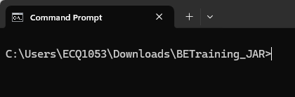
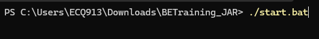

# Practical 23.1: Running be-services

For local development, the application requires running multiple services to simulate the production environment effectively. Developers need to run four jar files locally, each 
representing a critical component of the application. These jar files work together to provide the necessary backend functionality for testing, debugging, and developing features.

● Download the following based on your Operating System: 	○ If you are using Windows: 
		■

● Unzip the zip file. There should be a script file included (either a .sh for MacOS or Linux 	or .bat for Windows)

● Open command prompt in the unzipped folder

● Run the jar files through the script provided: 
	○ For Windows: 
		■ Run the script using ./start.bat

● The script should open 5 terminal windows with the following KAIZEN microservices: 	IAM, Common, Console, Gateway, IAM Proxy:

Ensure that the applications run with no exceptions/stack traces. Alternatively, you can look out for the default Spring Boot Application started message (ie. Started Application in xx.xxx seconds (process running for xx.xxx))

Practical 23.2: Update Profile feature 	● Click “Profiles” plugin

● Add a new “localhost” profile

● Click on Test Connection to test connectivity

● Select “Use by viewer”. Selecting this feature will ensure that the application’s users with 	external or internal viewer roles will use this profile when previewing the application.

● Click to switch the profile

● Click OK to reload the site

● Ensure a Tick sign appears on the localhost profile

● Refresh the page, note that API calls are made using your configured profile “localhost”, 	which allows users to do local development.

Notice that all these data loaded on your application’s ‘Page1 Table’ page are taking the data you have added in your schema earlier using the Database Designer Tutorial.

Tutorial 24: Customize Privilege for Page

Permission

This tutorial covers the following Learning Objectives:

● Understand the Importance of Page Permissions in securing application pages and 	controlling user access.

● Learn to Define Custom Page Privileges and configure custom privileges for specific 	application pages to grant access.

Now that you are able to get your application successfully running on your local profile, you can easily develop and test the integration between your backend code logic and your frontend application screens. However, the concern with your current application is that any user will be able to access all pages in your application. In this tutorial, you’ll explore how you can configure your pages with custom privileges to control its access privileges. We will go into more detail about all the other Identity and Access Management (IAM) features in the last tutorial.

● Click on setting and select Privileges

● Click Create to open a popup

● Enter the following value: 
○ User Domain: training_product 
○ Privilege Name: betraining_<username> (example: betraining_yongheng) ○ Privilege Code: be001 
○ Subject Type: betraining

● Click Save

● Edit each page to add in the necessary privileges

The above configuration of privileges for the respective pages mean that only users with roles that have the corresponding privilege would be able to access the respective page in the application. This step will ensure that your local application would be able to run smoothly after the next tutorial on code generation for backend.

More details on the other IAM features will be covered in the last tutorial.

