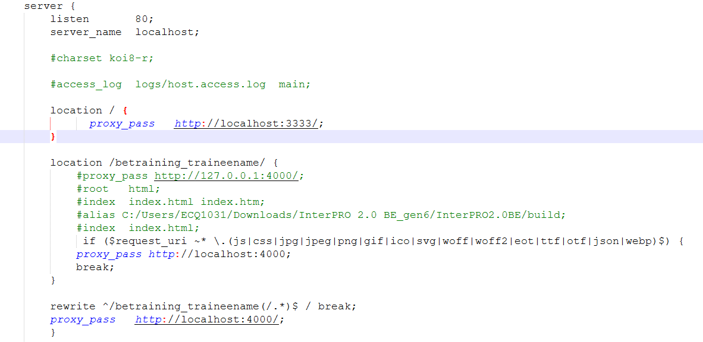

# Running nginx

● Edit the nginx/nginx.conf value in the nginx folder to your username 	○ betraining_traineename (Example: betraining_amandalam)

New nginx conf

For macOS: 
Copy paste file inside /opt/homebrew/etc/nginx folder

● Double click the nginx.exe to start the service. Some helpful command for debugging: ○ start nginx 
○ nginx.exe -s stop 
○ tasklist /FI "IMAGENAME eq nginx.exe"

For macOS: 
○ sudo nginx 
○ sudo nginx -s stop

Running the generated code 
	● Navigate to http://localhost/betraining_traineename/#/loginpage, you should be able

to see your login screen.

(Example: http://localhost/betraining_amandalam/#/loginpage)

After login to your account, you will be redirected and see the table listing

