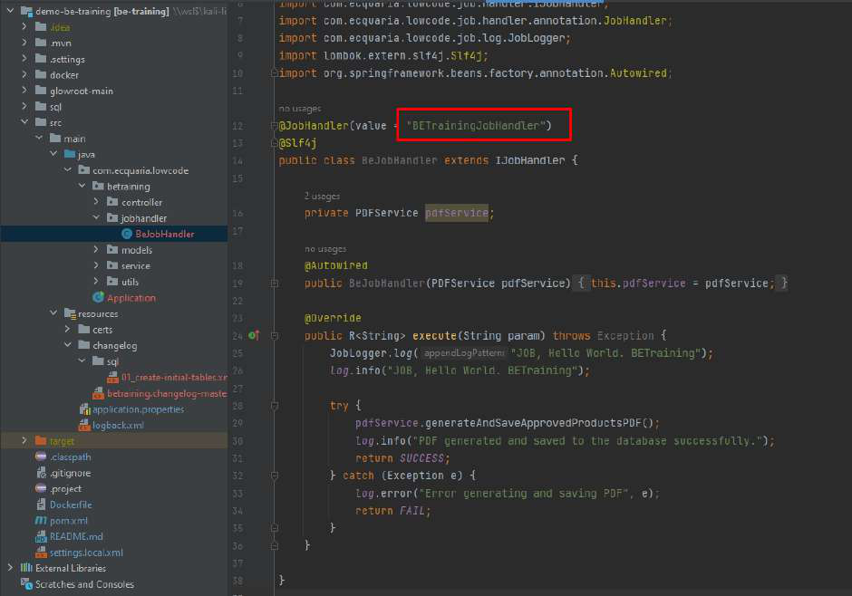
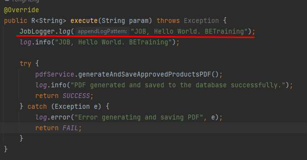
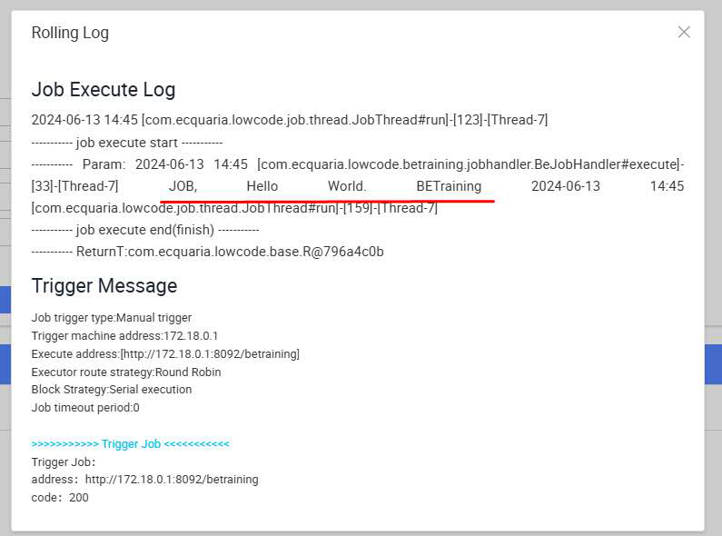
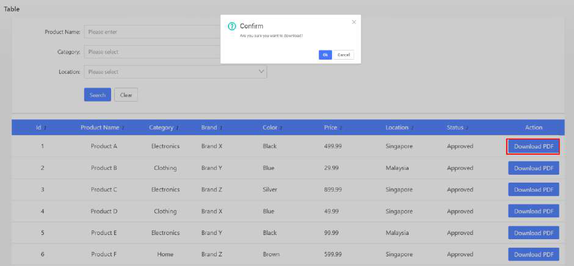
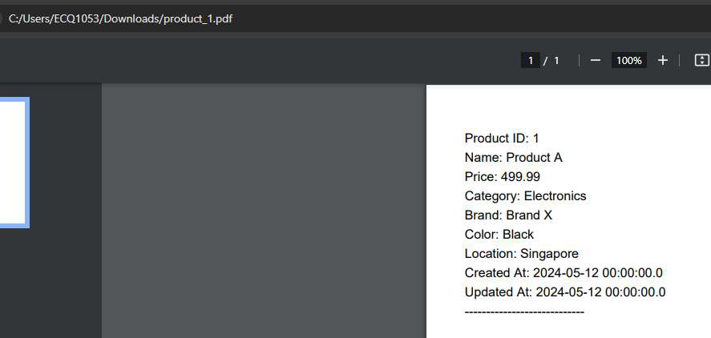

# Tutorial 27: Job Scheduler

This tutorial covers the following Learning Objectives:

● Understand how to set up and configure a job scheduler within your application. ● Learn to automate tasks at predefined intervals to improve efficiency.

● Manage task execution to ensure the smooth operation of automated processes.

In this tutorial, you will learn how to configure a job scheduler within your application. The job scheduler allows you to automate tasks, enabling predefined processes to run at specific times or intervals. This feature helps manage routine tasks more efficiently, reducing manual effort and ensuring consistent operations.

A JobHandler function is already prepared for the training. We will go through a demonstration of how a Job can be created and used. The Job Scheduler is only accessible to an admin role.

Practical 27.1: Creating and RunningJob(Demonstration)	● The PDF generation of product listing has been configured to run via job scheduler. If we 		click the Download button, no file is downloaded because the job is not running.

● As an admin, you can create a job scheduler via the “Create” button.

● Endpoint assignment is also required for JobHandler to execute.

● Run the Job function by clicking on the dropdown.

● From the “Job Log”, note that we can view the job execution success or failure.

JobLogger function allows log to be written to the Job Scheduler log

JobLogger.log("JOB, Hello World. BETraining");

● Back to our application, when we click the “Download” button, a PDF file is downloaded.

Note: 
1) For custom service to appear in the dropdown, it needs to be added to the “service.names.mesh” property in application.properties file.

Example: 
application.propertiesfile

...

...

service.names.mesh:'{"iam":{"host":"kaizen-trg-be-iam-service.kaizen-
trg.svc.cluster.local","port":8082,"contextPath":"/iam"},"console":{"host":"kaizen-trg-be-console-service.kaizen-
trg.svc.cluster.local","port":8083,"contextPath":"/console"},"common":{"host":"kaizen-trg-be-common-service.kaizen-
trg.svc.cluster.local","port":8084,"contextPath":"/common"},"job":{"host":"kaizen-trg-be-job-service.kaizen-
trg.svc.cluster.local","port":8085,"contextPath":"/job"},"gateway":{"host":"kaizen-trg-be-gateway-service.kaizen-
trg.svc.cluster.local","port":8081,"contextPath":""},"pagescan":{"host":"kaizen-trg-be-lighthouse-scanner-service.kaizen-
trg.svc.cluster.local","port":8086,"contextPath":""},"workflow":{"host":"kaizen-trg-be-workflow-engine-service.kaizen-
trg.svc.cluster.local","port":8087,"contextPath":"/workflow"},"setup":{"host":"kaizen-trg-be-setup-service.kaizen-
trg.svc.cluster.local","port":8089,"contextPath":"/setup"},"betraining":{"host":"kaize n-trg-be-training-service.kaizen-
trg.svc.cluster.local","port":8092,"contextPath":"/betraining"},"iamproxy":{"host":"ka izen-trg-be-iam-proxy-service.kaizen-
trg.svc.cluster.local","port":8091,"contextPath":"/iamproxy"}}' 
...

...

