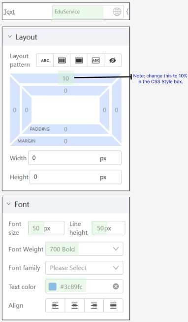

# Practical 1.3: Add 4 Text components

Ensure that the left Box component is selected

In the Component Library

Search for keyword “text”,

Drag one Text Component into Box (left)

Set the following properties and styles

Expected result will be:

Add three additional text components and set the following properties and styles:

Your completed left box should look like this:

