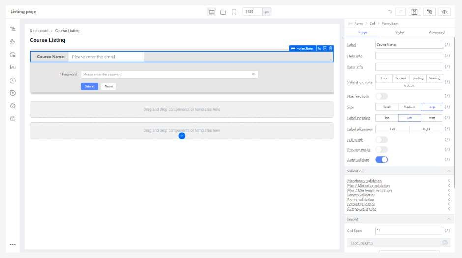

# Practical 3.3: Create Search form

Select the second Cell and set the following:

Select “Form Template” from “Component Library” and drag into the second “Cell”

Select the first “Form Item” by clicking on the label

In the first form item, set the following:

In the Input, set the following:

Remove the Password Form.Item

Remove the associated Cell

Click “Duplicate” 3 more times. Please take note to copy the Cell item, not the Form

item.

Remove the second “Input’”

Replace the Input with a “Select” component

Set the Form.Item and Select component to the following:

Delete Input and replace it with a rating component

Set the Form.Item and Rating component to the following:

Update Form.Item property and replace the fourth “Input” with a “3 Columns” component

In the “3 Columns” component, insert a “Number Input” to the first and third column. Delete the “Form Item” Label and set the Size to Large.

Add a “Text” component to the second column. Similarly, click on its “Form Item” parent

component and delete the Label.

Set the Text component to the following:

Set the Column (With Number Input) to the following

Set the Column (With text) to the following:

Set the Column (Last number input) to the following:

Click on last form.item (Containing area)

In the Form.Item (With Submit Button), set the following:

Props

Size: Large Wrapper Column

Span: 0

Offset: 3

Styles

margin-top : -10px;

Set the “Reset” button label with the following

