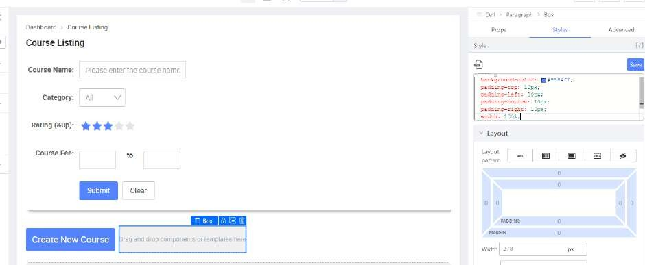

# Practical 3.4: Create List header

Drag a “Button” to the third “Block”

Set the following

Drag a “Box” beside the Button

Set the Box with the following:

Drag a “Text” component into the “Box”

Set the Text with following:

