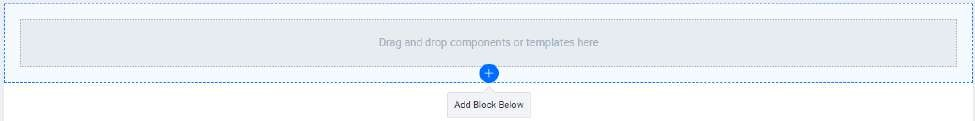
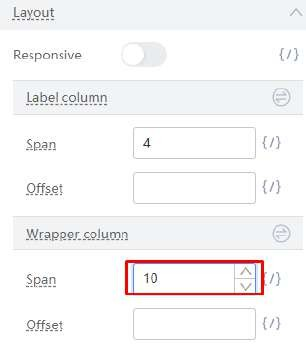
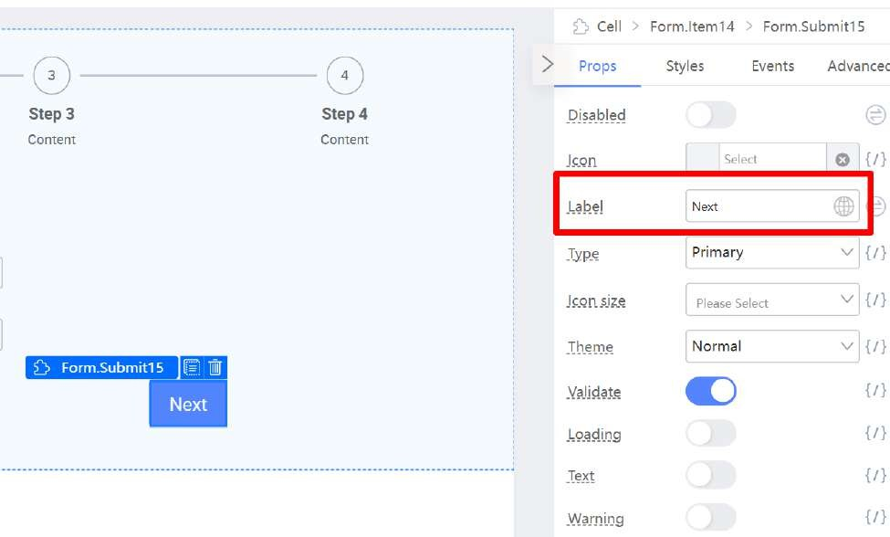
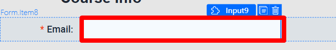
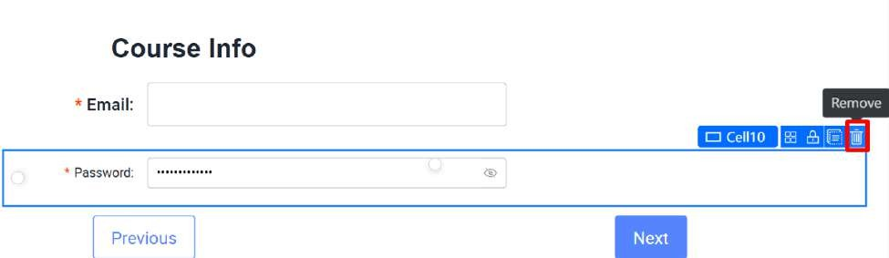
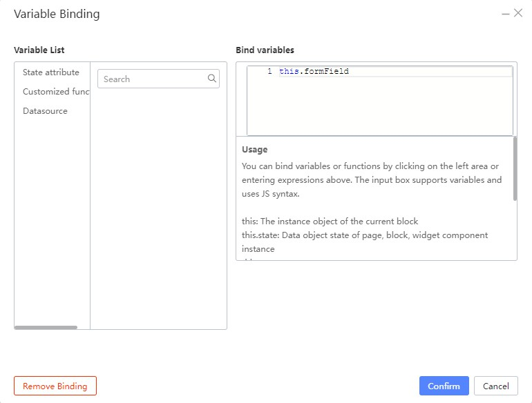

# Creating the Form skeleton

Before the Tutorial begins, please do the following steps. This is to set up the form for the rest of the Practicals. Most of these should be familiar if you have done the Tutorials before, but still, try and closely follow the following steps:

Create a new Form Page.

Click on Add Block Below at the bottom.

Search for Steps component

Drag the Steps component to the top empty Cell.

Search for Form Template component

Drag the Form Template component to the bottom empty Cell.

Select Form component, under Properties (Props) of Form Component, set the following:

Search for Form Item component

Drag the Form Item component above the Email field.

Clear the Label field

Change the Wrapper column’s Offset to 3.

Drag a Text component to the top of the Form Template. Change the Styling and Properties of the text component to the following:

The expected output will be

Click on the Form Item containing area (as illustrated in the image below)

Change the Wrapper column’s Offset to 4.

Remove the Reset button

Click on the Form Item containing area

Ensure Cell is selected (Note you also see a white circle, which is a split cell icon)

Click the split cell icon to split the cell into two

Select the Form Item with the submit button on the left side and click Duplicate.

Drag the duplicated Form Item with the submit button to the right side.

The expected output will be:

Select the Form Item on the right (illustrated below)

Set the properties of Form Item to below

Select the Submit button

Under Properties Label, change Submit to Next.

You should expect to see something like this:

Style and configure the left button into a ‘Previous’ button.

Select the Form.Item. Under the Props tag, change Size to Large. Under Layout, change the Wrapper span to 14 and the offset to 5.

Select the Button. Under Content, change ‘Submit’ to ‘Previous’, Button Type to

Secondary.

And the button should look like this:

Select the Email Form Item Label by clicking on the label (illustrated below)

Change the Styling and Properties of the Email Form Item.

Select the Input component

Clear the Placeholder under properties

Select the Cell containing area (illustrated below)

Ensure the Cell is selected

Remove the Cell containing Password Form Item

Select the Form component (illustrated below)

Under the Props tab, click on the Field - Variable Binding (looks like this {/}).

Under the Bind variables text area, key in this.formField. We will go more into this variable later. For now, just click the Confirm button after typing it in.

Duplicate the Course Info Form 3 times. There should be 4 ‘Course Info’ Forms now.

Change the text in the bottom 3 Forms to ‘Instructor Particulars’, ‘Class Location’, ‘Class Schedule’ in order.

Change the Step sub-headers to their respective Step names:

Step 1: Course Info

Step 2: Instructor Particulars Step 3: Class Location

Step 4: Class Schedule

The expected output will be:

