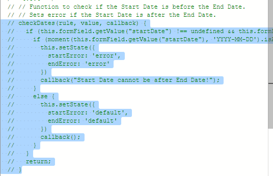

# The Source Code Panel

Let’s bring over the code we will be using for today’s tutorial to the Source Code Panel:

In the Kaizen App Designer, open the Source Code Panel on the left.

You should see the Source Code Panel appear on the left of the canvas:

Click on the gray button below to open a text file:

Tutorial4-Code.txt

Copy everything in this file to the Text Area in the Source Code Panel, like so:

Click the Save button on the top right of the Source Code Panel.

In this tutorial, the Source Code Panel will be used to handle some of the more complex logic for the forms not covered by the UI. If you are already familiar with JS and coding in general, you can skip to the next section (Practical 4.2).

Note that you will not be required to actually code. However, you will be required to do some uncommenting of the code. The following steps will guide you through the process:

Highlight a section of a commented code (text in green). A commented section of code will not be executed by the application. Essentially, it will be ignored.

Press Ctrl + / to uncomment the code.

There is an easy way to tell through the editor if the code is commented. If the text is

green, it is commented. If the text is not green, it is not commented. Make sure to save your changes.

