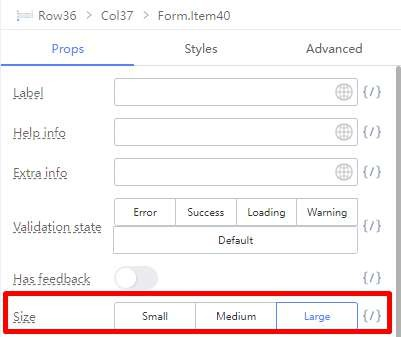

# Creating a Field with 2 inputs

Sometimes you will need to create a form field with 2 fields. The example we used in this scenario is a floor/unit no (eg #02-16) field.

Here is the revised table with the Floor and Unit No. separate.

It is possible to handle this in the Designer by using the 2 Columns or 3 Columns Component.

Remove the Input component within the Floor / Unit No. Form Item.

Drag a 3 Columns Component to the Floor / Unit No Form Item.

Drag a Form Item Component each for the left and right columns. Drag a Text Component into the Center column.

Drag Input Components into the left and right Form Items.

Ctrl + Click to select both Form Item Components.

Change their Styles to Large.

Select the left Form Item. Clear its Label and change its Property Name to floorNo Select the right Form Item. Clear its Label and change its Property Name to unitNo

Delete the Label of the center Form Item component

