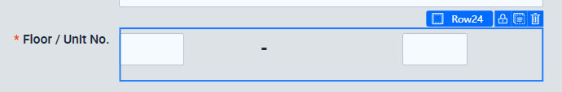
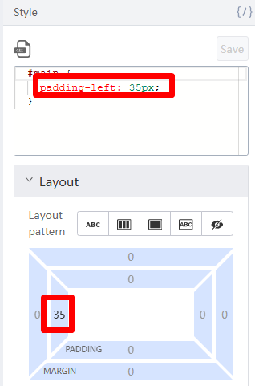

# Styling for the Inputs

Ctrl + Select both Input Components. Delete their Placeholders. In Styles, change their

width to 80px.

Change the center Text Component to be a Dash (ie. ‘-’). Change Font Size to h4.

Select the Row Component inside the Floor / Unit No Form.Item.

Change the width of the row to 200px.

Select the Center Column Component.

Add a left padding of about 35px. The dash should be roughly aligned with the input boxes like this:

