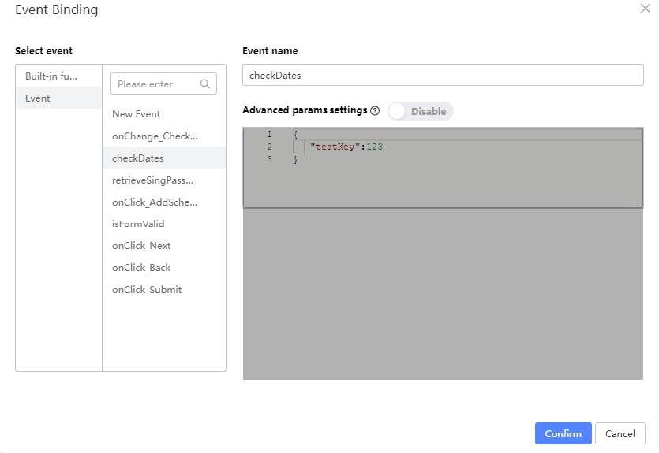
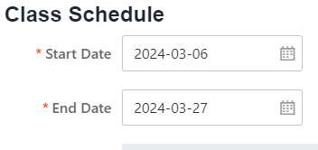

# Custom Date Validation

Open the Source Code Panel and uncomment lines 7 - 8.

Uncomment the section under (lines 39 - 57). Then click the Save button.

Select the Start Date Form Item. Variable Bind the validation state to

this.state.startError

Select the End Date Form Item. Variable Bind the validation state to

this.state.endError

Ctrl + Click to select both the Form Items of Start Date and End Date.

Go to the Props tab, and click on Custom validation. Then, click on the Bind Function

button.

Under Select event, click on Event, then click on checkDates. You should get something like this before clicking on the Confirm button:

Go to Preview and check if the validation is working as intended by selecting the dates for both datepickers and deliberately choosing invalid values.

