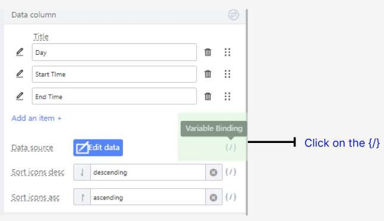

# Creating the Form field that can add new Rows

Delete the DatePicker component under Weekly Schedule field

Remove the Mandatory Validation

Drag a Table Component to the Weekly Schedule Form Item.

Select the Table Component. Under the Props tab,

Turn off pagination.

Remove the ‘Add’ and ‘Edit’ entries in the Action Bar.

Remove the ‘Edit’ and ‘Preserve’ entries in the Action Column.

Add another Cell below the Weekly Schedule Table Form Item.

Then, drag a Button Component into it.

In the Props Tab for the button’s Form Item, change the following

Clear its Label

Size: Large

Wrapper Column offset to 4 so that it aligns with the table.

Change the button’s text to Add Schedule.

Add a + icon to the button

Select the Table Component again. Change the Data Columns to ‘Day’, ‘Start Time’ and ‘End Time’.

Edit each column by clicking on the pen icon on the left of each label. Change the Data Keys of Day, Start Time and End Time to ‘day’, ‘start’ and ‘end’ respectively. Set all their Data Types to ‘None’.

Repeat the above steps for Start Time and End Time

Drag a Select Component into the Date Column. Drag a Timepicker Component into the Start Time and End Time Columns.

Select one of the Select Components in the Day Column and add the following Options

Monday’, ‘Tuesday’, ‘Wednesday’, ‘Thursday’, ‘Friday’, ‘Saturday’ and ‘Sunday’.

Select the Timepickers in the Start Time and End Time columns. Under the Props tab,

Set the Format to HH:mm

In the Styles tab, set the width of the Timepickers to 150px.

Open the Source Code Panel and uncomment lines 9 - 13.

Uncomment the section under /** 4.5.5 **/ (lines 61 - 69). Then click the Save button.

Select the Weekly Schedule Table Component. Click on Variable Binding in Data Source.

Click on State Attribute under Variable List, then click on weekly. Then click the

Confirm button.

Click on the Add Schedule button. Go to the Events tab, and click on the ‘Component native event’ button.

Select the onClick event from the dropdown.

Under ‘Select event’, click on Event, then click on onClick_AddSchedule. Then Click the Confirm button.

You can now add extra schedules!

