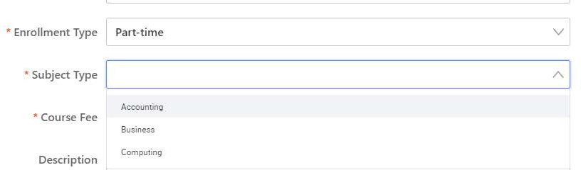

# Adding the Logic

Open the Source Code Panel and uncomment lines 14 - 25.

Uncomment the section under /** 4.6.3 **/ (lines 76 - 81). Then click the Save button.

Click on the Select Component of the Enrollment Type Form Item. In the Events tab, click on the Component native event button and then click onChange from the dropdown.

Under Select event, click on Event, then click on onChange_EnrollmentType. Once done, click on the Confirm button.

Click on the Select Component of the Subject Type Form Item. Click on the Switch Setter on the top right of the Datasource panel.

Select the Variable Input from the dropdown.

Click on the “Please input expression” box and select this.state.subjectTypeArray

You can now click preview and check out the result: Part-time:

Full-time:

Online/Remote:

