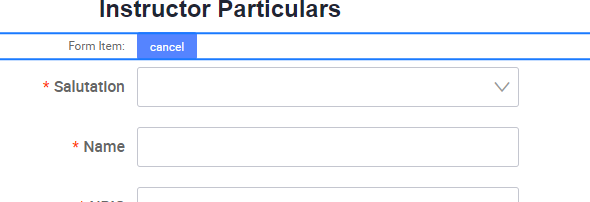

# Adding the ‘MyInfo’ Button

Scroll to the Instructor Particulars Form.

Add a button to the top of the Form below the title. Remove the Form Item Label. Under

the button’s Form Item Styles tab, Shift button to the right.

Download the sample MyInfo button image here MyinfoBtn.png

Upload the MyInfoBtn.png image to your assets -> image

Under the button’s Styles tab, change the button background image to MyInfo.

Go to the Button’s Props tab and set the Theme to ‘Ghost’. Remove ‘cancel’ from the

Content field.

