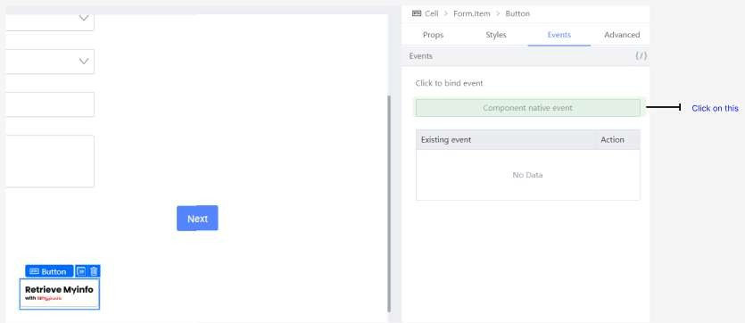

# Adding the logic

Uncomment the section under /** 4.7.4 **/ (lines 85 - 90). Then click the Save button.

With the MyInfo button selected, go to Events tab and click Component native event

and select ‘onClick’ in the dropdown.

Select Event under ‘Select Event’ and type in retrieveSingPassMyInfo under ‘Event

Name’. Click the ‘Ok’ button.

Preview and check if the fields are populated correctly by clicking on the MyInfo button.

