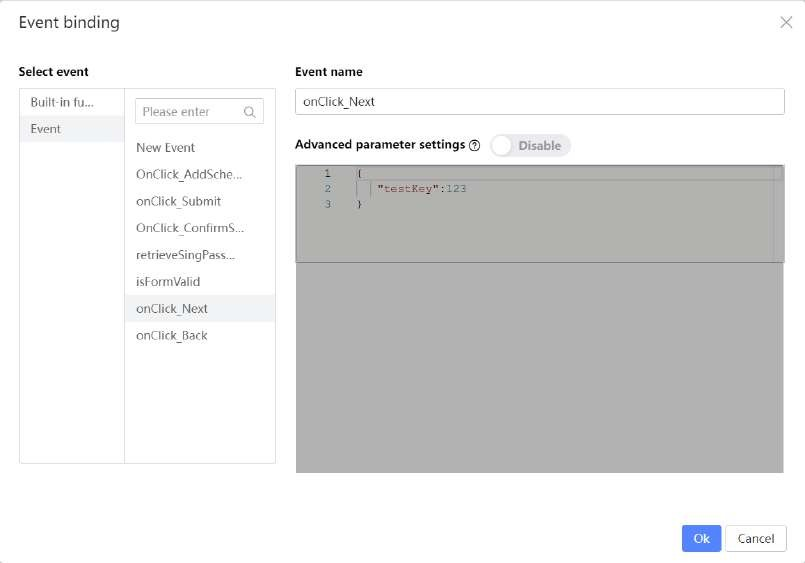

# OnClick Events for the Next buttons

Select all the Previous Buttons in the Forms and disable them.

Select the Next Button in the Course Info Form and go to the Events tab. Bind

onClick to the onClick_Next event.

Do the same for the ‘Instructor Particulars’ (2nd Form) and ‘Class Location’ Forms (3rd

Form).

For the ‘Class Schedule’ Form (4th Form), change the Label of the Next button to ‘Submit’.

