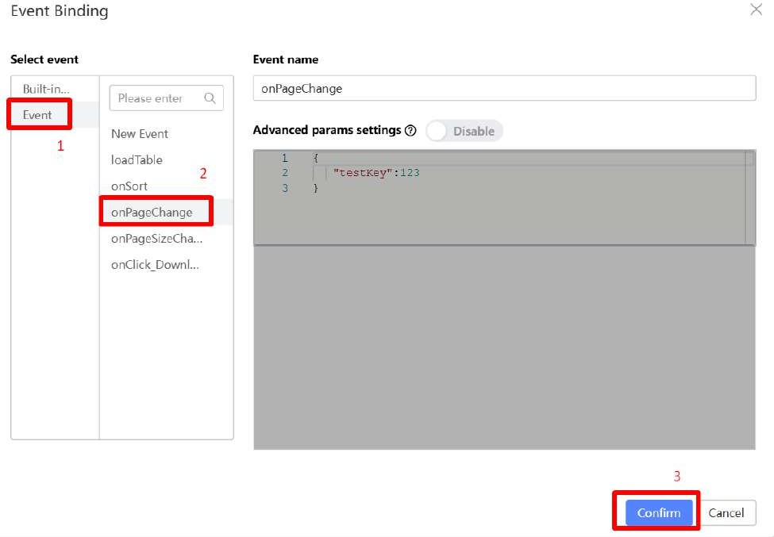

# Pagination

Something you probably noticed is that the table is only displaying 10 entries even though the dataset has 22 entries in total. That’s because the Table and the code placed in the Source Code Panel has catered for pages in the table. However, there is no way to navigate the pages or change the page size. Let’s change this.

Open the Source Code Panel. Uncomment lines 277 - 282

Under the Pagination Configuration, click on the Variable Binding for field Current Page

Under Variable List, Select ‘State attribute’ then select ‘currentPage’.

Still under the Pagination Settings, click on the Variable Binding for ‘Total records’.

Under Variable List, Select ‘State attribute’ then select ‘dataCount’.

Still under the Pagination Settings, click on the Variable Binding for ‘Show page size’.

Under Variable List, Select ‘State attribute’ then select ‘pageSize’.

In the OnChange field, click on the Bind Function button.

Under Event, click on the onPageChange event.

In Preview mode, now you can click on the pages at the bottom-right of the table and each page should display each page set of data correctly.

