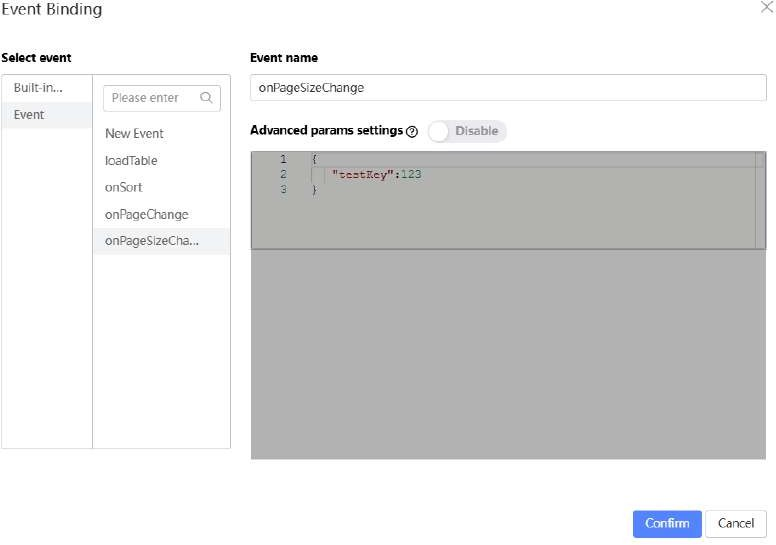
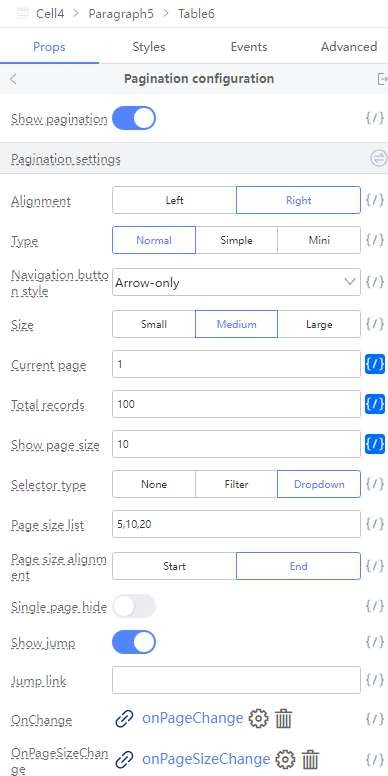

# Page Sizing

Let’s continue to add a Page Size feature.

Open the Source Code Panel. Uncomment lines 286 - 293.

In the Selector type field, choose ‘Dropdown’.

Page size list should be ‘5,10,20’

In the OnPageSizeChange field, click on the ‘Bind Function’ button.

Under ‘Select event’, Click on ‘Event’, then click on ‘OnPageSizeChange’.

Click on the ‘Confirm’ button.

These are the options you should have:

Now you can Preview to check all the changes that we added.

