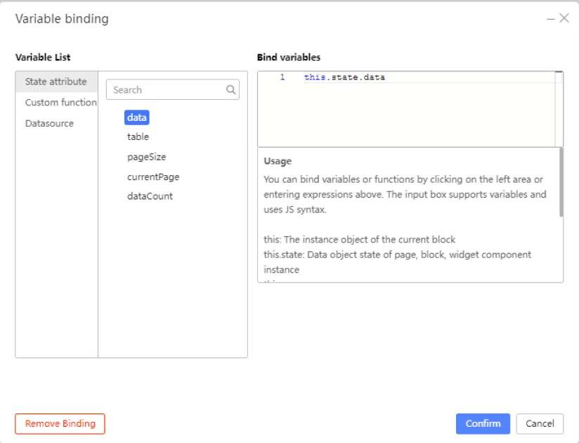

# Sending Data to the Graph

Select the Column Component and under the Props Tab, click on Variable Binding.

Under ‘Variable List’, Select ‘State attribute’, then select ‘data’.

Click the ‘Confirm’ button.

Note the graph has disappeared.

Change the ‘x-axis label’ to price and the ‘y-axis label’ to name.

With the Bar Chart Component still selected, go to the Styles tab and change the Height to 600px.

If you click on Preview, you can hover over each column to see their specific x-axis labels.

