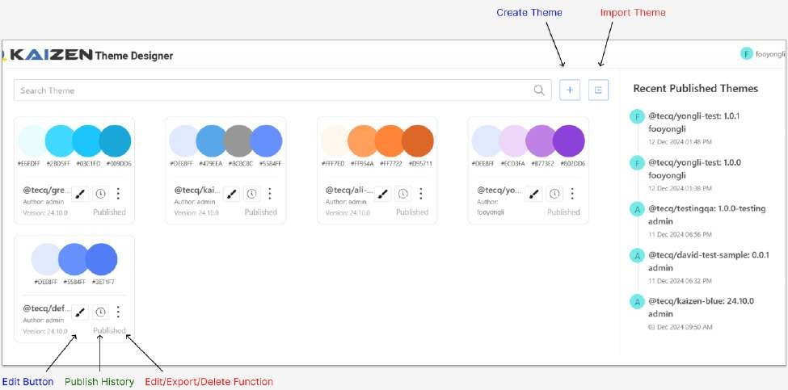
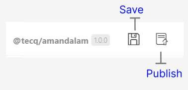
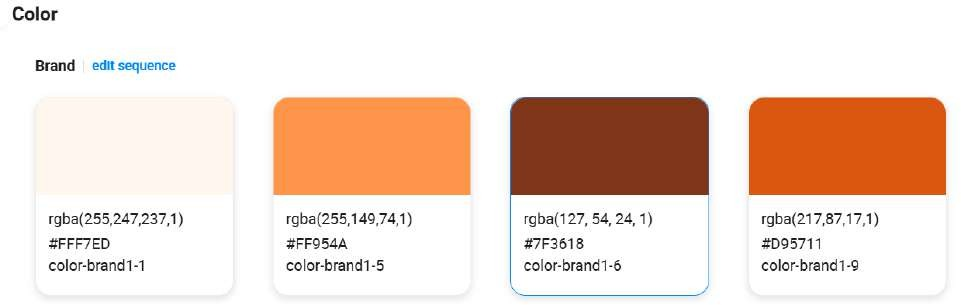
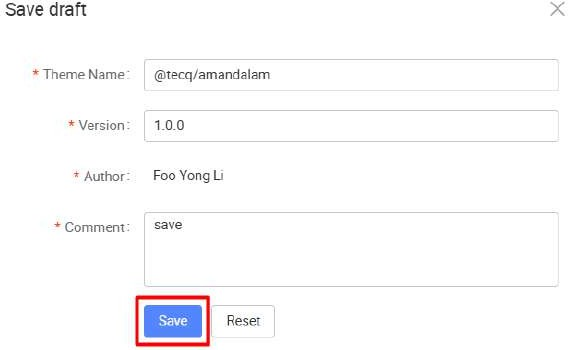

# Practical 8.1: Customize new theme

This tutorial will guide you through the customization of application themes using the KAIZEN Theme Designer, enabling you to maintain consistent branding and improve UI/UX with minimal coding.

Open your browser, go to the Theme Designer URL, and log in using your credentials.

URL: https://kaizen-daas.toppanecquaria.com/theme-editor/#/login Username: <username>

Password: <password>

After login, you will see a list of themes available and published history panel

Edit: Users can further customize their selected theme by clicking the Edit button

Publish History: Users can access the Publish History feature to view the previously published versions of the selected theme.

Setting: Additional setting to edit/export/delete theme.

Create (+): User can start to create a customize theme

Import: You can click the Import button to bring existing themes into the designer

Now, let's start to create new project for our new theme:

Click on Create Theme, and follow the naming convention @tecq/ to ensure proper integration.

Theme Name: For standard name convention, The theme name must start with @tecq/<username>. This is required for now as all js libraries integration

Version: We can add a version number to control and track updates. The recommended format should be Major.Minor.Patch (1.0.0).

Inherit: For the Inherit option, you can choose which theme you can copy from. So the new theme will be created based on the inherited theme.

For the inherit option, we can either inherit from the KAIZEN default theme or inherit from the customized theme.

For this case we will inherit from @tecq/ali-orange-24.10.1.

Configure as per the above with your theme name prefixed with your username ‘@tecq/<username>’ (E.g. @tecq/amandalam). After configure, click on the Save button to save your theme.

Once the theme is created, you may access it by clicking on the design icon .

Before we go any further, let’s take a brief aside to talk about the components of the Theme

Designer.

Header Pane:

The Header Pane serves as a central control point for theme management, offering users the ability to save or publish their theme customizations.

Save Functionality: Users can save their theme progress at any point, ensuring that any adjustments made to colors, layouts, fonts, or other design elements are securely stored. This allows users to work incrementally without the risk of losing their changes.

Publish Functionality: Once the theme is finalized, users can use the Publish feature to make their customized theme live across KAIZEN App Designer . This function ensures that all users or viewers will see and apply the newly updated theme.

Designer Pane:

The Designer Pane plays a crucial role in offering real-time visibility to the changes users apply while customizing their theme or design elements. As users make adjustments—whether it's altering the layout, modifying colors, or changing fonts—these changes are instantly reflected in the Designer Pane. This real-time feedback allows users to see how their design evolves without needing to reload or switch views, ensuring a smooth and uninterrupted workflow.

Component Pane:

Global Styles

Global styles are settings that apply to the entire application or design system, ensuring consistency and scalability. They are used to configure the styling of your components.

Component

Components are individual, reusable UI elements that follow the global style guidelines. They are building blocks of the interface and can be customized with predefined properties.

Token Configuration Pane:

Once user click on the color, user will see the token Token Configuration Pane on the right hand panel.This pane enables users to adjust a wide range of design properties, such as borders, padding, text size, and colors for specific UI components (in this case, a button). It allows for detailed and precise styling adjustments, ensuring components align with the overall design language of the theme.

Let's try to design a new theme. We will first customize a new color scheme for your brand.

Click on Global Style > Color, you can see 3 available color codes for Brand, let’s edit the second color brand1-6 code. The color selection will appear once you click the color code.

Let's try to edit color-brand1-6 code with this hex color #7F3618.

Once finished the color-brand1-6 will immediately change its color display as below.

Next, you can apply this new color code to Components. When you click on the "Button" menu under the "Component" section, you will immediately see the effects for the "Active" color states for buttons

Description of Token Configuration

Once complete, click on Save to store your personalized theme.

This button here is to publish the theme to the Nexus repository, Note that publishing a theme to a Nexus repository does indeed take some processing time, typically around 5- 10 minutes. In the interest of time, we will skip this step for the training.

Once the theme is published, you will be able to start applying the published theme in the app Designer. Once a theme is published, it becomes publicly accessible and can be viewed and used globally.

