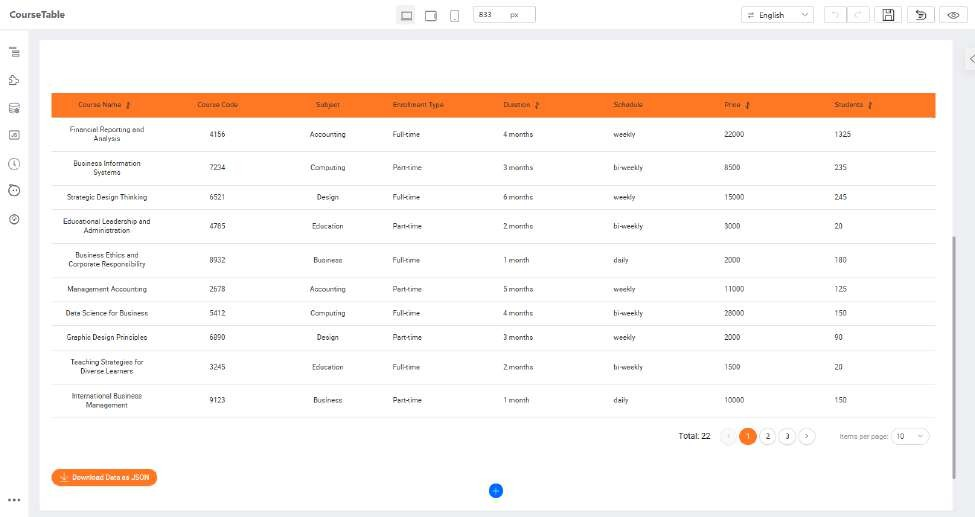

# Practical 8.2 Apply theme to your application

We have pre-created a theme to be applied onto your Designer Training application. First, login to KAIZEN and access the App Designer of your application. Navigate to the Course Table page.

Click on the theme design button and select the @tecq/ali-orange theme to apply, then click Ok.

The page will be reloaded for the changes to take effect. After that, you will see the colour and style of the components of your application has changed according to this newly applied theme.

