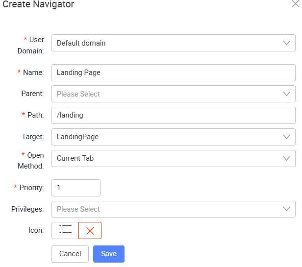

# Navigator Creation

Navigate back to your own project and application.

Click on Navigator to edit the setting

Now, when you preview your application, you will be able to see your newly created navigator, which brings you to the Landing Page upon click.

