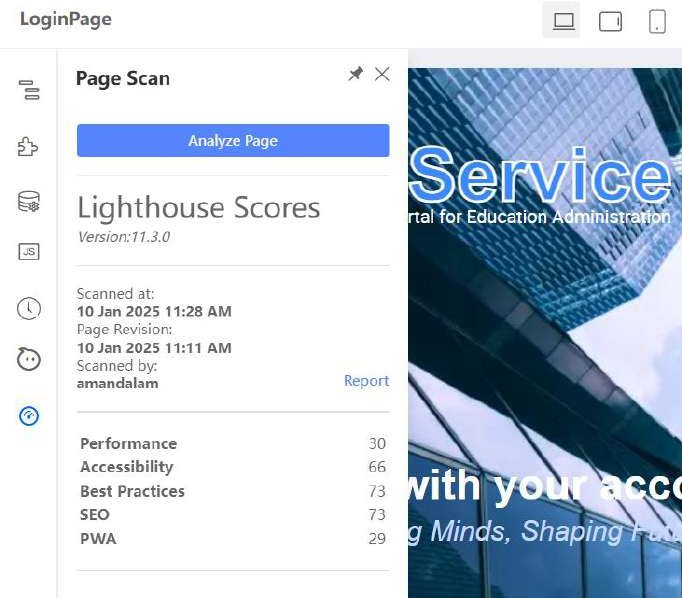

# Practical 10.1: Page Analysis with Page Scan (Demonstration)

This practical covers the following Learning Objectives:

Understand how to perform a comprehensive page scan using the platform's built-in tool which analyzes web apps and web pages, collecting modern performance metrics and insights on developer best practices.

Analyze key metrics such as Performance, Accessibility, Best Practices, SEO, and Progressive Web App (PWA) compliance to identify areas for improvement.

In this practical, you will learn how to use the platform's page scanning capabilities to evaluate your pages against industry-standard metrics, optimize them for better performance and accessibility, and ensure they meet the latest web development best practices.

Select the “Page Scan” plugin and click ‘Analyze Page’.

Upon scanning, you will also be able to download the report of the page scan which will also give you further insights such as recommended changes to your page.

