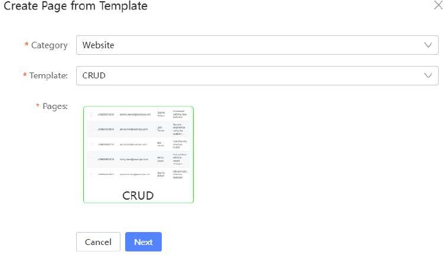

# Tutorial 11: Page Import From Template

This tutorial covers the following Learning Objectives:

Learn how to import pages from pre-designed templates to speed up application development.

Understand how to customize imported templates to fit your specific application needs.

Explore the benefits of using templates for consistency and efficiency in your design process.

In this practical, you will learn how to import pre-designed pages from templates, allowing you to quickly start building your application with a solid foundation. We’ll guide you through the process of customizing these templates to meet your project’s requirements, saving you time and effort in the design phase. By the end of this tutorial, you will be able to leverage templates to create consistent, professional-looking pages in your application while ensuring they align with your specific needs.

Create an application from a template.

Select the CRUD Template and select its page.

Fill in the necessary details and click Save.

Just like that, your new page is created by using the selected template.

