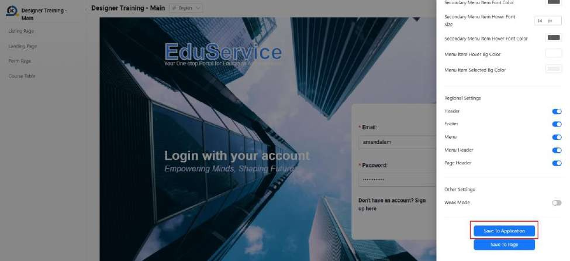
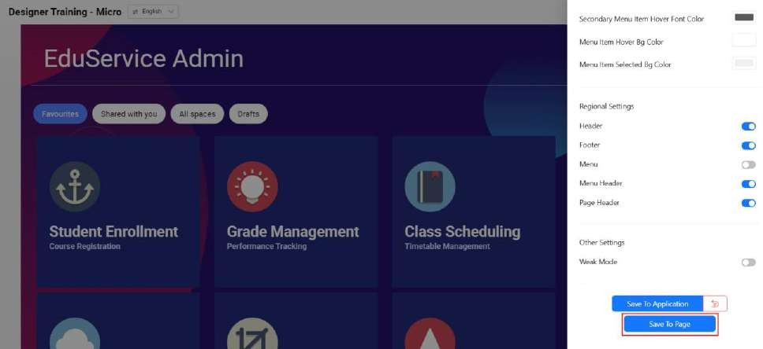

# Tutorial 12: Main and Micro Applications

This tutorial covers the following Learning Objectives:

Understand how to set up and manage a main application and micro-application architecture.

Learn the advantages of micro-application architecture for scalability and flexibility.

In this tutorial, you will learn how to set up a main application with micro-applications. Micro- application architecture allows you to split your application into smaller, more manageable components, which enhances scalability, flexibility, and performance—an ideal solution for rapidly evolving environments. This aligns with the micro-frontend framework.

These two Main and Micro applications have been created for you. Your current Designer Training Application that you have been working on is a “Standalone” application type.

Generally, the Main application will contain the menu and it will load child Micro application(s). Note that one Main application can be tied to multiple micro applications.

Navigator should be done in the Main application. Refer back to Practical 9.2 for more details.

Customization of global layout should be done in the Main application via ‘Save to Application’ function. Refer back to Practical 9.2 for more details.

Customization of individual layout should be done in the Micro application via ‘Save to Page’ function. Refer back to Practical 9.2 for more details.

