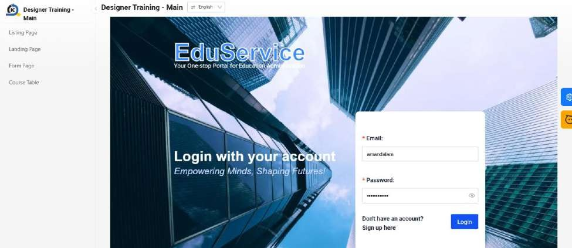

# Practical 12.1 Export and Import Pages to Main/Micro Apps (Optional)

This practical covers the following Learning Objectives:

Understand how to export and import pages in the App Designer.

In this practical, you will learn how to export and import your pages for use. This will be required in development when you need to either duplicate your existing pages in your application for ease of development, or in the case of this tutorial, to import pages into other applications.

In your Designer Training application, we will first export the login page and import it over to the Main application.

Export Login Page from your original Designer Training application

Import into the Designer Training - Main application

Do the same for the rest of the pages and import it accordingly as follows. Ensure to save and publish your applications once all imports are done.

Designer Training - Main

Login Page

Designer Training - Micro

Listing Page

Landing Page

Form Page

Course Table

Create the navigator in your main app to point to all 4 pages in the micro app.

Once you preview your main app, you will be able to navigate to the different pages via the menu bar.

