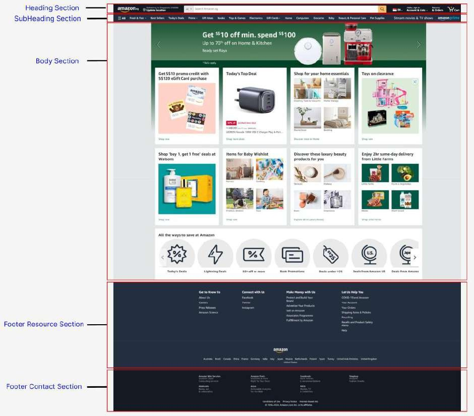
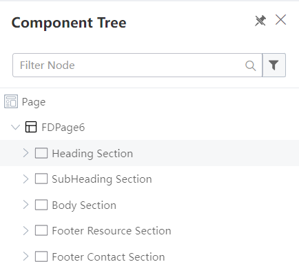
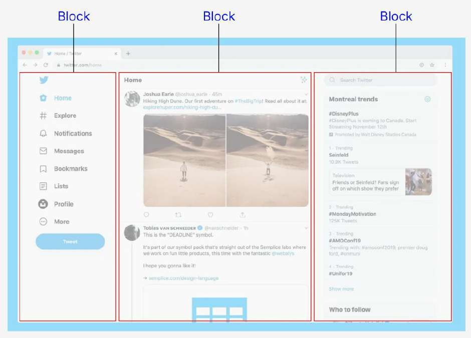

# Layout: Section vs Block

Section:

Organization: Takes up the entire width (100%) and provides a clear and structured way to organize content. Each section can represent a distinct topic or category, making it easier for users to navigate and understand the layout.

Customization: Sections allow for more customization options in terms of layout, styling, and functionality. You can apply different designs, backgrounds, and behaviors to each section as needed.

Scalability: Sections offer scalability, allowing you to easily add or remove content sections without affecting the overall layout. This flexibility is particularly useful for websites or applications with dynamic or evolving content.

Readability: By dividing content into sections, you can improve readability and comprehension for users. Clear demarcations between sections help users understand the flow of information and locate relevant content quickly.

Block:

Granularity: Using multiple blocks allows for a more granular approach to content management. Each block can represent a smaller unit of content or functionality, giving you finer control over the layout and presentation.

Flexibility: Blocks offer flexibility in arranging content within a section. You can easily rearrange blocks or add new ones without restructuring the entire layout, providing greater adaptability to changing requirements or user preferences.

Example (Using Section)

Using the https://amazon.sg website as an example, we will explain why it is preferable to use Sections over Blocks

Creating the skeleton of amazon.sg website in KAIZEN

Example (Using Block)

Using the Twitter (https://twitter.com) website as an example, we will explain why it is preferable to use Blocks over Sections

