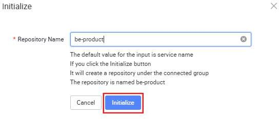

# Backend - Initialize Git Repository

Backend - Create Service (Prerequisite)

You may initialize your BE repository through the Service Designer after the creation of your microservice(s).

Let us first create an empty Product Service first so that the BE repository can be initialized. Note that a microservice for your application needs to be created first before you can initialize your BE Git repository. Not to worry as we will cover more details on the Service Designer tutorial below.

Click Services to launch the user interface.

Select Add Service in the Service API Designer.

In the configuration panel, name your microservice to represent its function (e.g.,

"Product” for Product microservice). Click Apply.

In the Service Designer, the Product Service has a couple of features which we will explore further in later tutorials.

In your Service Designer, click on the Git icon (Manage Branch) on your Service.

Click Initialize to set up your BE repository.

You should be able to see this newly created repository reflected on Git as well.

KAIZEN will create these 3 repositories under the defined group.

Note:

If you connect to git again with the repositories already present and initialized, clicking on the initialized button will not create new repositories. The success message will flag out accordingly that this repository with this name has already been initialized when connecting.

