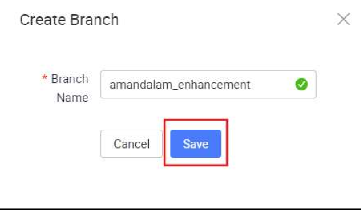

# Backend Git Branch Management (Optional)

Similarly for BE, we will proceed to create a new branch in the Service Designer. This will allow us to work on our new feature enhancements before merging into the main branch.

You should be able to see this newly created branch reflected on Git as well.

Switch to the new branch from the service designer. Select the branch to switch to in

the dropdown and click ‘Apply’.

